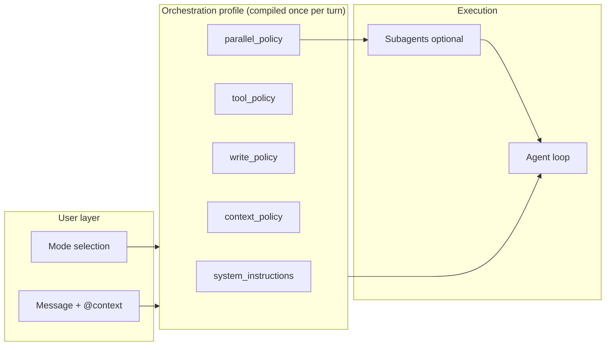
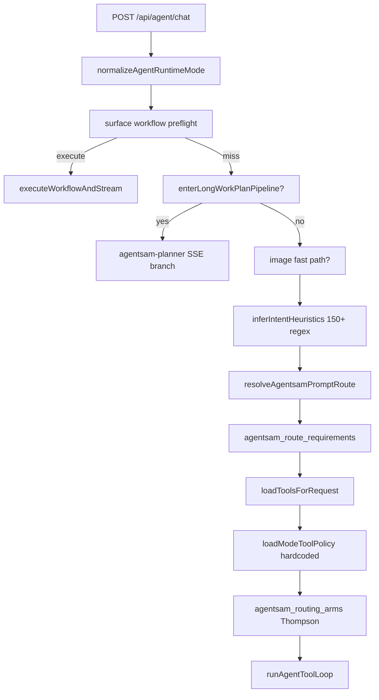
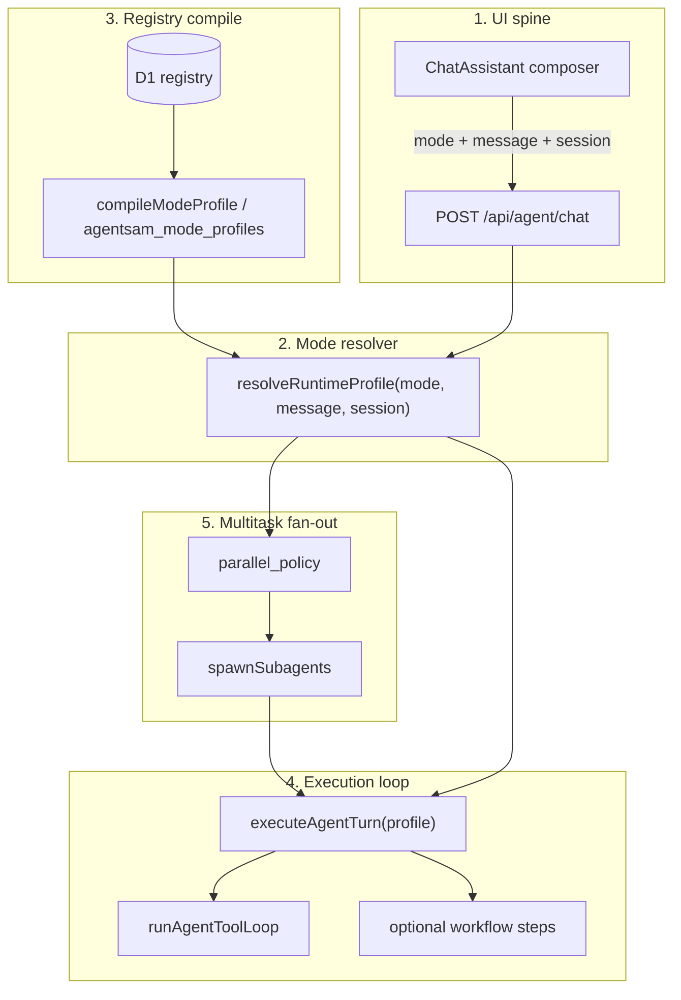
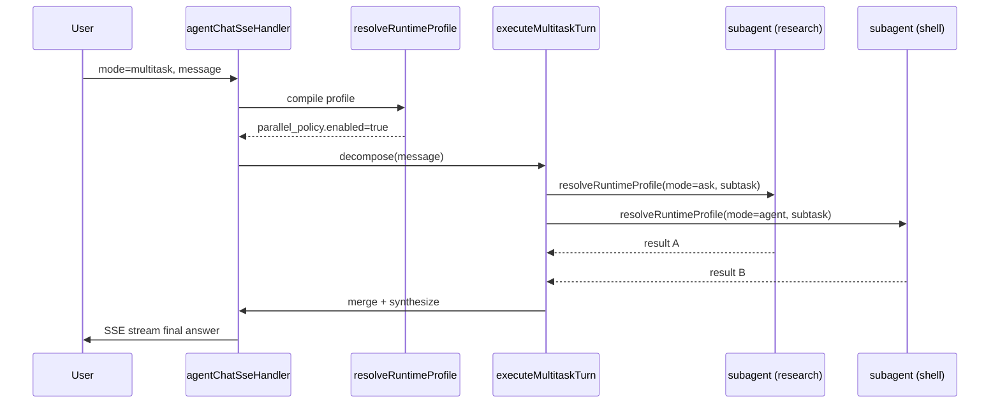
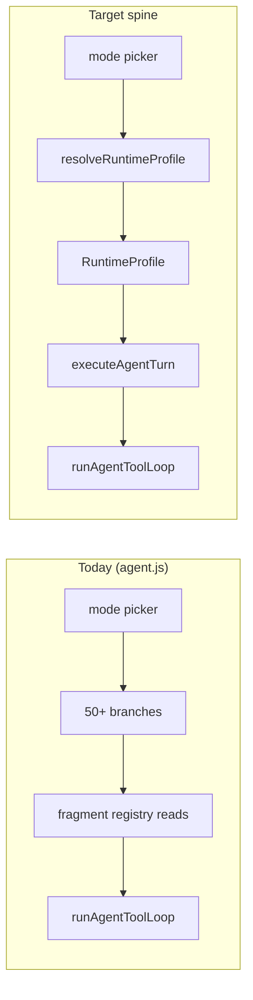

# Agent Sam Refine — 5 Modes. 1 Spine.

**Last updated:** 2026-05-31  
**Thesis:** Cursor’s simplicity is not fewer capabilities — it is **one user-facing enum** that compiles to **one orchestration profile** consumed by **one execution loop**. Agent Sam already has the UI enum and the loop (`runAgentToolLoop`); it was missing the compile step. The registry should answer “what profiles exist?” at **compile/deploy time**, not “what should this turn do?” at **request time**.

**Status snapshot**

| Phase | Status | Notes |
|-------|--------|-------|
| **0 — Schema + contract** | **Shipped (working tree)** | Types + mode enum; not yet on `HEAD` commit |
| **1 — Compiler (shadow → live)** | **Shipped** | `compileModeProfile`, live spine in `agent-chat-spine.js`, ~2.1k lines removed from `agent.js` |
| **2 — Thin handler** | **Shipped (chat path)** | `executeAgentChatSpine` replaces legacy maze; surface preflight + workflow execute still pre-spine |
| **3 — Dashboard parity** | Not started | Shift+Tab, single `mode` field |
| **4 — Multitask fan-out** | Not started | `parallel_policy` on profile only |

---

## Cost-responsible runtime contract

**One compile, one model pick, one loop.**

| Step | What happens | Cost control |
|------|----------------|--------------|
| 1. Login | Session → `userId` + `workspaceId` | — |
| 2. Pick mode | UI sends `mode` only | Mode sets `write_policy` + tool cap — no regex router |
| 3. Compile profile | `resolveRuntimeProfile` — one D1 batch | Flat `tool_allowlist`; no per-turn registry scatter |
| 4. Model | **Auto** → `resolveModelForTask` (Thompson on `agentsam_routing_arms`) | **One** sample, not a 5-model chain |
| 5. Execute | `runAgentToolLoop` with profile tools + prompt | Ask/plan skip expensive loops |

**Module map:** `src/api/agent-chat-spine.js` → `src/core/runtime-profile.js` → `src/core/resolveModel.js` → `runAgentToolLoop`

---

## Part 1 — Cursor’s mode simplicity (how it works for the user)

### What the user sees

Cursor collapses a large orchestration stack into **one composer surface** inside the Agent panel (Cmd+I / Ctrl+I; Agents Window via Cmd+Shift+P in recent versions).

| Surface element | User action | Effect |
|-----------------|-------------|--------|
| **Mode picker dropdown** | Click label in composer | Choose Agent / Ask / Plan / Debug / (Multitask via slash) |
| **Shift+Tab** | From chat input | Cycle modes without opening menus |
| **Slash commands** | `/multitask`, `/debug`, `/plan`, `/worktree`, `/btw` | Jump to specialized orchestration without re-architecting the UI |
| **Model picker** | Separate pill | Override model; orthogonal to mode |
| **Stop / queue** | While agent runs | Interrupt or queue follow-ups |
| **Agent tabs / tiled layout** | Multiple parallel threads | Each tab can hold its own mode + model + worktree |

The user never sees “routing arms,” “prompt routes,” or “capability lanes.” They pick **intent** (mode) and **power** (model). Everything else is product policy.

### What happens on mode switch — the “orchestration profile”

When the user switches mode, Cursor does not merely change a label. It swaps an **orchestration profile** — a bundled contract that downstream systems read as one unit:



**Profile fields (conceptual):**

- **system_instructions** — mode-specific behavior (“plan before code,” “read-only,” “instrument before fix”)
- **tool_policy** — which tools are available, which require approval
- **write_policy** — can edit files, run terminal, deploy
- **context_policy** — fresh vs continue; Cursor recommends **new chat on mode/task change**
- **parallel_policy** — whether subagents may fan out (Multitask)

**Shared across all modes (not modes themselves):**

| Capability | Role |
|------------|------|
| **Rules** | Always-on guardrails and conventions |
| **Skills** | Optional expertise injection |
| **Subagents** | Parallel workers; profile subset |
| **Model picker** | Cost/quality knob |
| **Checkpoints / diff review** | Safety layer on Agent/Debug |
| **Cloud Agents / browser agents** | Deployment surface, not mode |

Cursor docs: *“Project rules, user rules, and team rules apply in Agent, Ask, Plan, and Debug modes.”* Rules are ambient; modes are **autonomy sliders**.

### Each mode’s contract

#### Agent (default execution)

| Dimension | Contract |
|-----------|----------|
| **User intent** | “Do the work” — build, refactor, fix, test, deploy |
| **Allowed actions** | Read codebase, edit files, run terminal, use tools, iterate until done |
| **Typical flow** | Explore → plan implicitly → act → verify → fix errors |
| **User loop** | Review diffs, stop, queue follow-ups, restore checkpoint |

Agent is the **full write + tool loop**. Most tasks live here.

#### Ask (read-only understanding)

| Dimension | Contract |
|-----------|----------|
| **User intent** | Understand, explore, explain — no side effects |
| **Allowed actions** | Search/read codebase, answer questions; **no file edits** |
| **Typical flow** | Retrieve context → answer → optionally suggest (but not apply) changes |
| **Cursor guidance** | Use Ask *more often*; plan with Ask, implement with Agent |

Ask is **cognitive-only**. The simplicity comes from a hard guarantee: nothing mutates.

#### Plan (review-before-build)

| Dimension | Contract |
|-----------|----------|
| **User intent** | Design approach for complex, multi-file, or ambiguous work |
| **Allowed actions** | Research codebase, ask clarifying questions, produce editable plan |
| **Build phase** | After user approves — then edits (often by switching to Agent or clicking Build) |
| **Typical flow** | Clarify → research → plan doc → user edits → build |

Plan mode’s product insight: **preflight beats prompt archaeology**. Wrong direction mid-agent is expensive; wrong direction in a plan is cheap.

#### Debug (evidence-first fixing)

| Dimension | Contract |
|-----------|----------|
| **User intent** | Root-cause bugs that resist static reading |
| **Allowed actions** | Hypothesize → add instrumentation → user reproduces → analyze logs → targeted fix → remove instrumentation |
| **Typical flow** | Explore → instrument → reproduce loop → minimal fix → verify → cleanup |
| **Differentiator** | **Runtime evidence** before code changes; not “guess and patch” |

Debug is Agent-like on writes, but the **system contract** forces a scientific method loop.

#### Multitask (parallel orchestration)

Multitask is newer and surfaced via **slash command** (`/multitask`) and parallel agent tabs rather than always being in the Shift+Tab cycle.

| Dimension | Contract |
|-----------|----------|
| **User intent** | Large tasks that decompose into parallel workstreams |
| **Allowed actions** | Fan out subagents (research, shell, browser); each in own context; parent synthesizes |
| **Typical flow** | Decompose → parallel sub-runs → merge results → continue or hand back to Agent |
| **Related** | `/worktree` for isolated git checkouts; tiled agents in Cursor 3.1+ |

Multitask is **`parallel_policy = fan_out`**, not a different tool catalog — subagents inherit constrained profiles.

### Why it feels simple despite complexity underneath

1. **One enum, one profile** — User picks among ~5 intents; product compiles everything else once.
2. **Hard contracts** — Ask = no writes. Plan = no build until approved. Debug = evidence first.
3. **Orthogonal controls** — Model and mode don’t multiply each other in the UI.
4. **Single execution loop** — Same agent engine; profile gates behavior.
5. **Progressive disclosure** — Slash commands and subagents for power users.
6. **Context hygiene** — Fresh chat on mode change avoids polluted tool history.

The simplicity is **compile registry → flat profile → one loop**, not “consult twelve tables per turn.”

---

## Part 2 — The spine that reproduces this (IAM Agent Sam)

### Current state — verified gap (registry rich, runtime thin)

The dashboard **already mirrors Cursor’s mode enum**:

```typescript
// dashboard/components/ChatAssistant/types.ts
export type AgentMode = 'ask' | 'plan' | 'agent' | 'debug' | 'multitask';

export const AGENT_MODES = [
  { id: 'agent', label: 'Agent', description: 'Execute and open surfaces' },
  { id: 'plan', label: 'Plan', description: 'Design technical plans' },
  { id: 'debug', label: 'Debug', description: 'Inspect, prove, and fix' },
  { id: 'multitask', label: 'Multitask', description: 'Coordinate workflows' },
  { id: 'ask', label: 'Ask', description: 'Talk and answer questions' },
] as const;
```

The composer still sends mode **three ways** (compatibility debt):

```typescript
// ChatAssistant.tsx — target: mode only
form.append('mode', mode);
form.append('agent_mode', mode);           // remove in Phase 3
form.append('runtime_intent_mode', mode);   // remove in Phase 3
```

The server normalizes to one slug:

```javascript
// src/api/agent.js (target: import from src/core/agent-mode.js)
function normalizeAgentRuntimeMode(raw) {
  const v = String(raw || '').trim().toLowerCase();
  if (['agent', 'plan', 'debug', 'multitask', 'ask', 'auto'].includes(v)) return v;
  return 'agent';
}
```

**But after that, mode dissolves into scattered logic in `agentChatSseHandler` (~2,000+ lines):**



**Concrete gaps:**

| Layer | What exists | What runtime actually does |
|-------|-------------|---------------------------|
| **Mode config** | D1 had `agent_mode_configs` | **Dropped**; `loadModeConfig()` returns hardcoded defaults + gate/escalation models only |
| **Prompt routes** | Rich `agentsam_prompt_routes` rows | Partially used; overridden by greetings, browser heuristics, body pins |
| **Route requirements** | `agentsam_route_requirements` | Merged in `agentsam-route-tool-resolver.js` **plus** duplicate defaults in JS |
| **Routing arms** | Thompson bandit in `agentsam_routing_arms` | Model selection only; decoupled from mode profile |
| **Tool policy** | D1-capable design | **`agent-mode-tool-policy.js`** hardcodes ask/plan deny lists |
| **Plan mode** | User selects Plan | Special `enterLongWorkPlanPipeline` branch; not the same loop as Agent |
| **Ask mode** | User selects Ask | `agentChatDirectSseHandler` marked **DEAD CODE**; Ask goes through full handler with heuristics |
| **Multitask** | UI mode exists | Treated as `agentLikeTooling`; fan-out only via `agent-handoff.js` — no `parallel_policy` |
| **Intent** | `inferIntentHeuristics()` | Mostly ignored: `taskType = normalizeCanonicalTaskType(requestedMode)` |

**Root cause:** D1 is consulted **as runtime interpreter**, not **compile-time source**. Every subsystem reads registry fragments independently. The user picks Plan; the server runs a maze of booleans.

### Target architecture — five layers



---

### Layer 1 — UI spine

**Goal:** One composer, one POST contract, mode is authoritative.

**Keep:**
- `AgentMode` enum and `AGENT_MODES` in `dashboard/components/ChatAssistant/types.ts`
- Mode pill in `ChatAssistant.tsx`
- Single POST to `/api/agent/chat`

**Change (Phase 3):**
- Send **one** canonical field: `mode`
- Add **Shift+Tab** in composer to cycle `AGENT_MODES`
- Optional: mode-specific placeholder text
- **Do not** send `task_type` or `route_key` from UI unless advanced/debug

**POST contract (minimal):**

```typescript
{
  message: string
  mode: 'ask' | 'plan' | 'agent' | 'debug' | 'multitask'
  model?: string              // 'auto' | model_key
  conversationId?: string
  workspace_id?: string
  subagent_slug?: string      // orthogonal specialization
  // attachments, browserContext, workspaceContext unchanged
}
```

---

### Layer 2 — Mode resolver

**One function. One exit type. Everything downstream reads only this.**

**Module:** `src/core/runtime-profile.js`

```javascript
/**
 * @param {import('./runtime-profile.types.js').ResolveRuntimeProfileInput} input
 * @returns {Promise<import('./runtime-profile.types.js').RuntimeProfile>}
 */
export async function resolveRuntimeProfile(env, input) { /* ... */ }
```

**Resolver algorithm (deterministic, logged once per turn):**

1. Normalize mode via `normalizeAgentRuntimeMode` (`src/core/agent-mode.js`)
2. **Compile** base profile from D1 (Layer 3)
3. Apply **message refinements** (max 5 rules):
   - `simple_ask_greeting` if ask + short greeting
   - `browser` route if URL + navigate verb
   - `explicit_plan_phrase` → `execution_kind: 'plan_pipeline'`
   - Never override mode’s `write_policy`
4. Apply **user policy** gates (`agentsam_user_policy`: `can_run_pty`, etc.)
5. Apply **subagent profile** overlay if `subagent_slug` set
6. Resolve **model** via `agentsam_routing_arms` using `profile.routing_task_type` + optional user pin
7. Return immutable `RuntimeProfile` + `profile_hash` for cache/audit

**Shipped today (shadow lane):** steps 1–4 in `compileModeProfile` / `resolveRuntimeProfile`; step 6 still TODO; shadow log via `scheduleShadowRuntimeProfileCompile` in `agentChatSseHandler`.

---

### Layer 3 — RuntimeProfile schema

**The ONLY thing `runAgentToolLoop`, workflow executor, and SSE emitter should read.**

**Module:** `src/core/runtime-profile.types.js`

```typescript
type AgentMode = 'ask' | 'plan' | 'agent' | 'debug' | 'multitask'

type RuntimeProfile = {
  // Identity
  mode: AgentMode
  profile_id: string              // e.g. 'mode_plan@plan'
  profile_hash: string              // sha256 prefix for cache/audit
  profile_version: number

  // Prompt
  system_prompt_key: string | null
  system_prompt_inline: string | null
  prompt_layers: string[]

  // Tools (flat — no lanes at runtime)
  tool_allowlist: string[]
  tool_denylist: string[]
  tool_require_approval: string[]
  max_tools: number
  max_tool_calls: number
  max_turns: number
  max_runtime_ms: number

  // Write policy
  write_policy: {
    can_edit_files: boolean
    can_terminal: boolean
    can_d1_write: boolean
    can_deploy: boolean
    can_browser_automation: boolean
  }

  // Workflow (optional)
  workflow_key: string | null
  // Deprecated: `chat_loop` and `workflow_only` removed from runtime spine.
  execution_kind:
    | 'ask_turn'
    | 'plan_pipeline'
    | 'agent_tool_loop'
    | 'debug_investigation_loop'
    | 'multitask_fanout'

  // Context
  context_policy: {
    include_rag: boolean
    include_memory: boolean
    include_workspace: boolean
    fresh_thread_recommended: boolean
  }

  // Model routing
  routing_task_type: string
  model_key: string | null
  routing_arm_id: string | null
  temperature: number

  // Multitask
  parallel_policy: {
    enabled: boolean
    max_subagents: number
    allowed_subagent_types: string[]
    merge_strategy: 'synthesize' | 'first_success' | 'all'
  }

  // Audit
  source: {
    prompt_route_id: string | null
    route_requirements_id: string | null
    compiled_at: number
    compile_lane: 'shadow' | 'live'
  }
  refined_route_key: string | null
}
```

**Mode → default profile (product contracts matching Cursor):**

| Mode | `execution_kind` | `write_policy` highlights | `parallel_policy` |
|------|------------------|---------------------------|-------------------|
| **ask** | `ask_turn` | all writes false | disabled |
| **plan** | `plan_pipeline` | all writes false | disabled |
| **agent** | `agent_tool_loop` | full (subject to user policy) | disabled |
| **debug** | `debug_investigation_loop` | deploy false until verified/approved | disabled |
| **multitask** | `multitask_fanout` | full (subject to user policy) | enabled |

---

### Layer 4 — Registry → profile compile step

**Principle:** D1 is **source of truth for configuration**, not **runtime interpreter**.

**Why registry-as-runtime kills simplicity:**

- Each turn hits `agentsam_prompt_routes`, `agentsam_route_requirements`, `agentsam_tools`, `agentsam_mcp_allowlist`, `loadModeToolPolicy`, and `inferIntentHeuristics` — often yielding conflicting `max_tools`
- Debugging “why didn’t I get `d1_query`?” requires tracing 6 functions across `agent.js` and `agentsam-route-tool-resolver.js`
- New registry rows **do not automatically surface** unless every code path is updated

**Compile strategy:**

| Option | Status | Description |
|--------|--------|-------------|
| **B — Compile at request** | **Shipped (shadow)** | `compileModeProfile()` joins prompt routes + route requirements + tool select in one module |
| **A — Materialized table** | **TODO** | `agentsam_mode_profiles` + `scripts/compile-mode-profiles.js` |

**Option A schema (next Phase 1 deliverable):**

```sql
CREATE TABLE agentsam_mode_profiles (
  id TEXT PRIMARY KEY,
  mode TEXT NOT NULL,           -- ask|plan|agent|debug|multitask
  route_key TEXT,               -- nullable; NULL = mode default
  profile_json TEXT NOT NULL,   -- RuntimeProfile minus session fields
  source_route_id TEXT,
  version INTEGER DEFAULT 1,
  updated_at INTEGER
);
```

**Move into compiler, not request path:**

| Current runtime function | Becomes |
|--------------------------|---------|
| `resolveAgentsamPromptRoute` | Compiler input |
| `resolveAgentChatRouteToolRequirements` | Compiler input |
| `loadModeToolPolicy` | Compiler input (mode defaults) |
| `mergePromptRouteToolKeys` | Compiler step |
| `effectiveAgentChatToolCap` | Compiler step |

**Runtime target:** one SELECT from `agentsam_mode_profiles` OR one call to `resolveRuntimeProfile`.

---

### Layer 5 — Execution loop

**Goal:** `agentChatSseHandler` becomes ~150 lines.

```javascript
// src/api/agent-chat-handler.js (Phase 2 extract)
export async function agentChatSseHandler(request, env, ctx) {
  const body = await parseChatBody(request);
  const session = await resolveSession(request, env, body);
  const profile = await resolveRuntimeProfile(env, {
    mode: body.mode,
    message: body.message,
    session,
    overrides: { model_key: body.model, subagent_slug: body.subagent_slug },
    compile_lane: 'live',
  });

  await auditRoutingDecision(env, profile);

  switch (profile.execution_kind) {
    case 'workflow_only':
      return executeWorkflowAndStream(env, profile.workflow_key, ...);
    case 'plan_pipeline':
      return executePlanPipeline(env, profile, ...);
    case 'multitask_fanout':
      return executeMultitaskTurn(env, profile, ...);
    default:
      return streamChatLoop(env, ctx, profile, ...);
  }
}
```

**Delete from hot path (Phase 2):**

- `enterLongWorkPlanPipeline` → `profile.execution_kind === 'plan_pipeline'`
- `agentLikeTooling` → `profile.tool_allowlist.length > 0`
- Surface preflight maze → `profile.execution_kind === 'workflow_only'`
- Duplicate `max_tools` math (~7283–7303 in `agent.js`) → `profile.max_tools`
- `inferIntentHeuristics` as primary router → compiler-only refinement

**Keep in loop:**

- `runAgentToolLoop` — unified tool executor
- `validateToolCall` — enforce `profile.write_policy` + `tool_denylist`
- Guardrails, billing — handoff triggered by `parallel_policy`, not ad hoc tool names

---

### Layer 6 — Multitask / subagent fan-out



**Implementation sketch (Phase 4):**

- `executeMultitaskTurn` in `src/core/multitask-orchestrator.js`
- Decomposition: one LLM call with `profile.parallel_policy.max_subagents` cap
- Child profiles via `resolveRuntimeProfile` with per-subtask mode override
- Reuse `agentsam_subagent_profile` for **persona/model**, not tool policy
- SSE: `subagent_started`, `subagent_done`, `synthesis_token`
- UI: `AgentChatShellTab` for parallel threads; Multitask coordinates at server layer
- **Defer:** git worktree isolation (`/worktree`) — separate todo

---

### Layer 7 — Anti-patterns to delete

| Anti-pattern | Where | Replace with |
|--------------|-------|--------------|
| Mode branches in 20+ places | `agent.js` `requestedMode === 'ask'` | `profile.mode` / `profile.write_policy` |
| Multiple `max_tools` calculators | `agent.js`, `loadToolsForRequest`, route resolver | `profile.max_tools` |
| Hardcoded tool policy duplicating D1 | `agent-mode-tool-policy.js` | Compiler merges D1 + mode defaults once |
| `loadModeConfig` stub | `agent.js` ~2729 | Delete; fields on `RuntimeProfile` |
| DEAD `agentChatDirectSseHandler` | `agent.js` ~6283 | Delete or thin wrapper over `streamChatLoop` |
| `inferIntentHeuristics` as router | `agent.js` ~1318 | Max 5 refinement rules in resolver |
| `normalizeCanonicalTaskType(requestedMode)` | `agent.js` ~6930 | `profile.routing_task_type` from compile |
| Surface preflight bypass maze | `shouldBypassSurfaceWorkflowPreflight`, etc. | `profile.execution_kind === 'workflow_only'` |
| Triple mode form fields | `ChatAssistant.tsx` 1408–1410 | Single `mode` |
| Capabilities never merged to tools/list | route requirements vs catalog | Compiler resolves capabilities → tool names |

**Keep (valuable registry, wrong layer):**

- `agentsam_prompt_routes` — compile source
- `agentsam_route_requirements` — capability → tool mapping
- `agentsam_routing_arms` — model selection after profile mode is fixed
- `agentsam_workflow_handlers` — when `profile.workflow_key` set
- `runAgentToolLoop` — execution engine

---

## Part 3 — Phased implementation roadmap

### Phase 0 — Schema + contract ✅ (working tree)

**Deliverables:**

- [x] `RuntimeProfile` JSDoc in `src/core/runtime-profile.types.js`
- [x] `AgentMode` + `normalizeAgentRuntimeMode` in `src/core/agent-mode.js`
- [x] `RUNTIME_PROFILE_VERSION = 1`
- [ ] Shared enum CI guard (`dashboard` ↔ `src/core/agent-mode.js`)
- [ ] Document POST contract in API spec
- [ ] Emit `profile_hash` + `profile_id` on SSE `context` event (Phase 2)

**No production behavior change** — types only (+ shadow logging in Phase 1).

---

### Phase 1 — Compile path D1 → profile 🟡 (shadow lane shipped)

**Deliverables:**

- [x] `compileModeProfile()` in `src/core/runtime-profile.js`
- [x] `resolveRuntimeProfile()` + user policy gates (`can_run_pty`)
- [x] Shadow log: `[runtime-profile] shadow` on every chat via `scheduleShadowRuntimeProfileCompile`
- [x] Unit tests: `tests/unit/runtime-profile.test.mjs` (10 tests)
- [ ] Migration: `agentsam_mode_profiles` table
- [ ] Script: `scripts/compile-mode-profiles.js --dry-run`
- [ ] Per-mode tool_allowlist assertions against live D1
- [ ] Model resolution via `agentsam_routing_arms` in resolver (step 6)
- [ ] Subagent profile overlay in resolver (step 5)

**Validation:**

```bash
node --test tests/unit/runtime-profile.test.mjs
# After deploy: grep Worker logs for [runtime-profile] shadow
node scripts/compile-mode-profiles.js --dry-run   # when script lands
```

**First commit (done in working tree, not yet on HEAD):** Phase 0 types + Phase 1 shadow compiler — **zero branches deleted in `agent.js`**.

---

### Phase 2 — Thin handler (5–7 days)

**Deliverables:**

- Extract handler body → `src/api/agent-chat-handler.js`
- Wire `resolveRuntimeProfile` at top; branch on `execution_kind` only
- `runAgentToolLoop` receives profile-derived params
- Delete or gate: `agentLikeTooling`, `enterLongWorkPlanPipeline`
- Mirror **one** `agentsam_routing_decisions` row per turn with full profile snapshot
- SSE `context` includes `profile_id`, `profile_hash`, `execution_kind`

**Risk mitigation:** Feature flag `AGENT_RUNTIME_PROFILE=1`; shadow-compile alongside old path; log diffs 48h before cutover.

**Done when:** `grep -c "requestedMode ===" src/api/agent.js` → **0** (mode checks only in resolver + `validateToolCall`).

---

### Phase 3 — Dashboard parity (2–3 days)

**Deliverables:**

- Shift+Tab mode cycle in `ChatAssistant.tsx`
- Single `mode` form field (drop `agent_mode`, `runtime_intent_mode`)
- Mode-specific composer placeholder
- Dev-only: show `profile.mode` + `execution_kind` in debug stream panel
- `agentsamPolicy.auto_run_mode` still maps to default mode

---

### Phase 4 — Multitask fan-out (5–8 days)

**Deliverables:**

- `executeMultitaskTurn` + `parallel_policy` enforcement
- Child profiles via `resolveRuntimeProfile` with subtask mode override
- SSE events for subagent lifecycle
- Dashboard subagent progress chips (reuse `WorkflowRunBoard` patterns)

---

## Success metrics — 5 runtime acceptance tests

| # | Test | Pass criteria |
|---|------|---------------|
| **1** | **Plan mode, work intent** | User selects Plan, sends “plan auth refactor for dashboard”. One SSE stream. `plan_created` with tasks. No terminal tools. No file writes. ≤2 D1 reads before loop. |
| **2** | **Ask mode, data question** | User selects Ask, sends “how many rows in agentsam_plans?”. `d1_query` or clear policy refusal. Zero terminal/deploy in manifest. `write_policy.can_d1_write === false`. |
| **3** | **Agent mode, simple edit** | User selects Agent, sends “add a comment to ChatAssistant types”. `can_edit_files=true`. File tools in manifest. No `enterLongWorkPlanPipeline`. |
| **4** | **Debug mode, bug report** | User selects Debug, sends “why does /api/agent/chat 500 on empty workspace?”. Debug contract in system prompt. Read/search first. `profile.mode === 'debug'` in routing audit. |
| **5** | **Multitask mode, parallel work** | User selects Multitask, sends “audit D1 schema and run deploy smoke test in parallel”. ≥2 subagent SSE events. Parent synthesis. Subagent profiles respect write_policy subset. |

**Registry surfacing metric:** Adding a tool to `agentsam_prompt_routes.tool_keys` for `route_key='plan'` appears in `tool_allowlist` after compile — **no Worker code change**.

---

## Summary — before vs after



---

## File map (spine modules)

| File | Role |
|------|------|
| `src/core/agent-mode.js` | Mode enum + `normalizeAgentRuntimeMode` |
| `src/core/runtime-profile.types.js` | `RuntimeProfile` schema (Phase 0) |
| `src/core/runtime-profile.js` | `compileModeProfile`, `resolveRuntimeProfile`, shadow logging (Phase 1) |
| `tests/unit/runtime-profile.test.mjs` | Compiler unit tests |
| `src/api/agent.js` | Shadow hook only today; thin handler in Phase 2 |
| `src/api/agent-chat-handler.js` | Phase 2 extract target |
| `src/core/multitask-orchestrator.js` | Phase 4 fan-out |
| `scripts/compile-mode-profiles.js` | Phase 1b materialized compile |
| `migrations/NNN_agentsam_mode_profiles.sql` | Phase 1b D1 artifact table |

---

## Next commits (recommended order)

1. **Commit spine Phase 0+1 shadow** — types, compiler, shadow log, tests (no branch deletion)
2. **Phase 1b** — `agentsam_mode_profiles` migration + compile script + dry-run diff report
3. **Phase 2 flag** — `AGENT_RUNTIME_PROFILE=1` shadow diff logging vs live path
4. **Phase 2 cutover** — extract handler, delete boolean maze
5. **Phase 3** — dashboard Shift+Tab + single `mode` field

---

## Closing thesis

Agent Sam already has the **UI enum** and the **loop** (`runAgentToolLoop`). The missing piece was the **compile step**. Shadow compile is now wired — every authenticated chat request logs a flat `RuntimeProfile` without changing production behavior. The next proof point is **Phase 1b materialized profiles** and **Phase 2 cutover** where `execution_kind` alone decides plan vs chat vs workflow vs multitask — in one hop, like Cursor.
