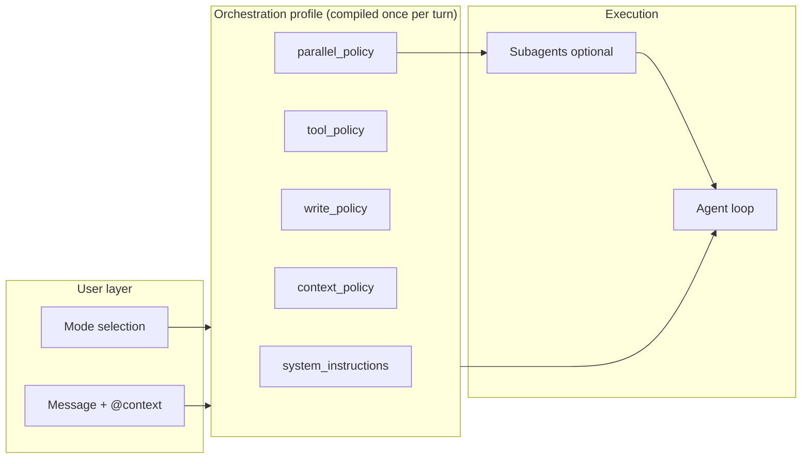
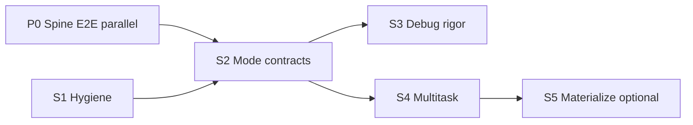

# Agent Sam Refine — 5 Modes. 1 Spine.

**Last updated:** 2026-07-22  
**File:** `agentsamrefine.md` (living SSOT for mode → profile → loop parity)  
**Related P0:** [`plans/active/AGENTSAM-SPINE-E2E-CURSOR-PARITY-2026-07.md`](plans/active/AGENTSAM-SPINE-E2E-CURSOR-PARITY-2026-07.md) (`tkt_agentsam_spine_e2e_20260716` — vision + thread + tools)  
**Related:** [`plans/active/CURSOR-PARITY-TOOL-DISCOVERY-2026-07.md`](plans/active/CURSOR-PARITY-TOOL-DISCOVERY-2026-07.md) · [`plans/active/AGENTSAM-MODE-PROFILE-SPRINTS-2026-07.md`](plans/active/AGENTSAM-MODE-PROFILE-SPRINTS-2026-07.md)

**Thesis:** Cursor’s simplicity is not fewer capabilities — it is **one user-facing enum** that compiles to **one orchestration profile** consumed by **one execution loop**. Agent Sam now has the compile step **and** live controllers; remaining gaps are **UI contract hygiene**, **hard write guarantees**, **true Multitask fan-out**, and the separate **vision/thread hot-path** P0.

---

## Status snapshot (2026-07-22 — verified against `main`)

| Phase | Status | Notes |
|-------|--------|-------|
| **0 — Schema + contract** | **Shipped** | `src/core/agent-mode.js`, `runtime-profile.types.js`, `RUNTIME_PROFILE_VERSION` |
| **1 — Compiler** | **Shipped (live)** | `compileModeProfile` / `resolveRuntimeProfile`; chat uses `compile_lane: 'live'` via `agent-chat-spine.js`. Shadow helper still exists for diagnostics |
| **1b — Materialized profiles** | **Not started** | No `agentsam_mode_profiles` table / compile script |
| **2 — Thin handler** | **Shipped (chat path)** | `executeAgentChatSpine` (~385 LOC) → mode controllers. `agent.js` still ~5.6k (auth, surface, workflow, legacy); chat no longer runs the old maze |
| **2b — Mode controllers** | **Shipped (thin)** | `ask` / `plan` / `agent` / `debug` / `multitask` under `src/core/mode-controllers/` |
| **3 — Dashboard parity** | **S1 shipped (partial)** | Shift+Tab + single `mode` POST + mode placeholders. Legacy server aliases retained one release |
| **4 — Multitask fan-out** | **Partial** | Controller exists; RWS fan-out only when `allow_subagent_spawn`; else falls back to Agent-class single loop. No Cursor-grade parallel SSE UX |
| **5 — Acceptance gates** | **S2 unit proofs shipped** | Ask/Plan/Agent (#1–#3) unit contracts green; live dual-pass E2E still open for ticket `shipped` |

**Module map (live):**

```text
POST /api/agent/chat
  → agent.js (auth / body / preflight)
  → executeAgentChatSpine
  → resolveRuntimeProfile | compileUserAppRuntimeProfile  (compile_lane: live)
  → resolveModelForTask (Thompson / pin)
  → mode_controller switch
       ask | plan | agent | debug | multitask
  → runSharedProfileToolLoop / plan pipeline / RWS fanout
```

---

## Current vs Cursor — gap matrix

| Cursor contract | Agent Sam today | Gap severity | Sprint |
|-----------------|-----------------|--------------|--------|
| One mode enum → one profile | **Yes** — `RuntimeProfile` compiled per turn | — | Done |
| Ask = hard no-writes | **Hard** — `mode-write-gate` seals write_policy; `validateToolCall` early-denies mutate (+ blocks codemode) | Low — live Ask E2E dual-pass remaining | S2 ✅ |
| Plan = research then approve, no build | **Hard** — same seal + gate; `execution_kind=plan_pipeline` | Low — live Plan E2E dual-pass remaining | S2 ✅ |
| Agent = full write + tool loop | `agent-controller` + shared loop; gate allows mutate when write_policy open | Low — depends on spine E2E (vision/thread) | P0 + S2 ✅ |
| Debug = evidence-first | Thin `debug-controller` (mostly shared loop + prompt) | Medium — force instrument/read-first contract | S3 |
| Multitask = parallel subagents + merge | Controller + optional RWS; often single loop | High | S4 |
| Shift+Tab mode cycle | **Yes** in composer | — | Done |
| Single POST `mode` field | **Yes** (S1) — server still reads legacy aliases | — | Done |
| Rules ambient / mode = autonomy | Rules in D1 + Cursor rules; mode sets write/tool caps | Low | Ongoing |
| Progressive tool discovery | P0–P2 in tool-discovery plan; not mode-static menus | Medium | Align w/ S2 |
| Fresh chat on mode change | Not enforced (Cursor recommends) | Low | S1 optional UX |
| Model picker orthogonal | Yes | — | Done |
| Vision + intact thread history | Separate P0 spine ticket | **Blocker for “replace Cursor”** | P0 spine |

**Honest % (mode/profile spine only):** ~65–70% of Cursor’s *mode orchestration* shape.  
**Honest % (replace Cursor for daily work):** gated by P0 spine E2E (vision + thread + real tools) — do not claim parity until that ticket dual-passes.

---

## Part 1 — Cursor’s mode simplicity (reference)

When the user switches mode, Cursor does not merely change a label. It swaps an **orchestration profile** — a bundled contract that downstream systems read as one unit:



**Profile fields (conceptual):**

- **system_instructions** — mode-specific behavior
- **tool_policy** — tools available / approval
- **write_policy** — edit / terminal / deploy
- **context_policy** — fresh vs continue
- **parallel_policy** — Multitask fan-out

**Shared across modes (not modes themselves):** Rules, Skills, Subagents, Model picker, Checkpoints, Cloud/browser agents.

| Mode | User intent | Hard contract |
|------|-------------|---------------|
| **Agent** | Do the work | Full write + tool loop |
| **Ask** | Understand | No side effects |
| **Plan** | Design first | No build until approved |
| **Debug** | Root-cause | Runtime evidence before patch |
| **Multitask** | Parallel workstreams | `parallel_policy = fan_out` |

Cursor docs: *“Project rules, user rules, and team rules apply in Agent, Ask, Plan, and Debug modes.”* Rules are ambient; modes are **autonomy sliders**.

---

## Part 2 — IAM spine today (not the May shadow draft)

### What exists (shipped)

| Piece | Path | Role |
|-------|------|------|
| Mode enum (UI) | `dashboard/components/ChatAssistant/types.ts` | `ask \| plan \| agent \| debug \| multitask` |
| Mode normalize | `src/core/agent-mode.js` | Server slug |
| Profile schema | `src/core/runtime-profile.types.js` | `RuntimeProfile` |
| Compiler | `src/core/runtime-profile.js` | D1 routes + requirements → flat profile |
| Spine | `src/api/agent-chat-spine.js` | Compile → model → `mode_controller` switch |
| Controllers | `src/core/mode-controllers/*` | Per-mode entry |
| Tool safety | `src/core/agent-tool-validator.js` | Enforces `write_policy` / denylist |
| SSE proof | `runtime-context.js` | Emits `profile_id`, `profile_hash`, `execution_kind` |
| Shift+Tab | `ChatAssistant.tsx` + `plan-mode-utils.ts` | Cycles `AGENT_MODES` |

### What still fights Cursor simplicity

| Anti-pattern | Where | Target |
|--------------|-------|--------|
| Triple mode form fields | `ChatAssistant.tsx` ~3133–3135 | Send `mode` only (Phase 3 / S1) |
| `agent.js` still huge | ~5618 LOC | Keep as edge/auth; no new mode branches |
| Ask mutation gate is regex | `ask-controller.js` | Keep as UX hint; **validator** is law — prove with E2E |
| Multitask ≈ Agent | `multitask-controller.js` | Always-on fan-out when policy allows; SSE lifecycle + UI chips |
| Debug is thin | `debug-controller.js` | Prompt + phase gates (read → instrument → fix) |
| Materialized profile table | missing | Optional S5 — faster cold start / audit |
| Unit tests broken locally | `tests/unit/runtime-profile.test.mjs` | Fix `auth` dir-import (S1) |
| Legacy `agentChatDirectSseHandler` | still in `agent.js` | Delete or thin-wrap (S1) |

### Cost-responsible contract (unchanged goal)

| Step | What happens | Cost control |
|------|----------------|--------------|
| 1. Login | Session → user + workspace | — |
| 2. Pick mode | UI sends **`mode` only** (S1) | Mode sets write_policy + tool ceiling |
| 3. Compile | `resolveRuntimeProfile` — one batch | Flat allow/deny; no scatter |
| 4. Model | Auto → `resolveModelForTask` | One Thompson sample |
| 5. Execute | Controller → shared tool loop | Ask/plan skip mutate tools |

---

## Part 3 — End-to-end sprints (close the gaps)

**Law:** dual-pass E2E before ticket `shipped`. Deploy ≠ pass.  
**Ordering:** Do **not** claim “Cursor parity” until **P0 spine E2E** (vision/thread/tools) and **S2 mode contracts** both dual-pass.



### Sprint S0 — Doc + baseline (this update)

**Outcome:** Living SSOT matches `main`; sprint ticket filed.  
**Done when:** This file + `plans/active/AGENTSAM-MODE-PROFILE-SPRINTS-2026-07.md` committed; status table above accurate.

---

### Sprint S1 — Dashboard + API contract hygiene ✅ (2026-07-22)

**Outcome:** Mode is one wire field; dead Ask fast-path removed; enum guard + profile tests green.

| # | Task | Status |
|---|------|--------|
| S1.1 | POST only `mode` (ChatAssistant + projectComposerChat) | ✅ |
| S1.2 | Mode-specific composer placeholder | ✅ |
| S1.3 | Optional mode-change toast | Skipped (not needed) |
| S1.4 | Fix `runtime-profile` unit tests (`core/auth` → `auth.js`) | ✅ |
| S1.5 | Delete dead `agentChatDirectSseHandler` | ✅ |
| S1.6 | `npm run guard:agent-mode` | ✅ |

**Exit:** Local unit tests + guard green; deploy with worker + frontend.

---

### Sprint S2 — Hard mode contracts (3–5 days) — **SHIPPED 2026-07-22 (unit proofs)**

**Outcome:** Ask/Plan cannot mutate; Agent can; progressive discovery respected.

| # | Task | Proof |
|---|------|-------|
| S2.1 | Ask: data question → read tools only; `write_policy.* === false` | ✅ unit Acceptance #2 (`mode-write-contracts.test.mjs`) |
| S2.2 | Plan: work intent → `plan_pipeline`; zero terminal/file writes via gate | ✅ unit Acceptance #1 |
| S2.3 | Agent: edit path; `can_edit_files`; mutate tools pass gate | ✅ unit Acceptance #3 |
| S2.4 | `validateToolCall` sole mutate gate (early Ask/Plan + no codemode bypass) | ✅ `mode-write-gate.js` + validator early return |
| S2.5 | Align tool menus with progressive discovery (no new static kits) | Deferred to tool-discovery ticket (no new menus added) |

**Code:** `src/core/mode-write-gate.js` · seal in `runtime-profile.js` · early gate in `agent-tool-validator.js`

**Exit (code):** Acceptance #1–#3 automated proofs green.  
**Exit (ticket `shipped`):** still needs **two live E2E passes** recorded on D1 (dual-pass law) — unit ≠ live SSE.

---

### Sprint S3 — Debug evidence-first (2–3 days)

**Outcome:** Debug feels like Cursor Debug, not Agent with a different label.

| # | Task | Proof |
|---|------|-------|
| S3.1 | System prompt + `debug_policy` phases: explore → instrument → reproduce → fix → cleanup | SSE / routing audit |
| S3.2 | Prefer read/search tools before write in first N turns | Tool manifest order / validator soft gate |
| S3.3 | Acceptance #4 dual-pass | Ticket events |

---

### Sprint S4 — Multitask fan-out (5–8 days)

**Outcome:** Multitask ≠ Agent clone.

| # | Task | Proof |
|---|------|-------|
| S4.1 | When `parallel_policy.enabled`, always decompose (cap `max_subagents`) | ≥2 child profiles |
| S4.2 | Child `resolveRuntimeProfile` with mode overlay + write_policy subset | Audit rows |
| S4.3 | SSE: `subagent_started` / `subagent_done` / synthesis | Client events |
| S4.4 | Dashboard chips / progress (reuse WorkflowRunBoard patterns) | UI |
| S4.5 | Acceptance #5 dual-pass | Ticket events |

**Defer:** `/worktree` isolation (separate ticket).

---

### Sprint S5 — Materialized profiles (optional, 2–3 days)

**Outcome:** Registry compile at deploy/ops time; request path is one SELECT or one function.

| # | Task | Proof |
|---|------|-------|
| S5.1 | Migration `agentsam_mode_profiles` | Remote apply |
| S5.2 | `scripts/compile-mode-profiles.js --dry-run` then apply | Diff report |
| S5.3 | Runtime prefers materialized row; falls back to live compile | Shadow log |

---

### Parallel P0 (does not replace S1–S4)

[`AGENTSAM-SPINE-E2E-CURSOR-PARITY-2026-07.md`](plans/active/AGENTSAM-SPINE-E2E-CURSOR-PARITY-2026-07.md):

1. Vision (images intact on hot path)  
2. Thread memory (no destructive normalize before provider)  
3. Tools actually execute (D1 / CF / GitHub / FSA)  

Without P0, mode parity is cosmetics.

---

## Success metrics — 5 runtime acceptance tests

| # | Test | Pass criteria |
|---|------|---------------|
| **1** | Plan + work intent | Plan artifact / tasks; no terminal; no file writes; profile `execution_kind=plan_pipeline` |
| **2** | Ask + data question | Read evidence or clear refusal; `can_d1_write === false`; no deploy/terminal in manifest |
| **3** | Agent + simple edit | `can_edit_files=true`; file tools used; no plan-pipeline hijack |
| **4** | Debug + bug report | `profile.mode=debug`; read/search before write; debug contract in prompt |
| **5** | Multitask + parallel | ≥2 subagent SSE events; parent synthesis; child write_policy ⊆ parent |

**Registry metric:** Adding a tool key on a prompt route appears in compiled `tool_allowlist` after compile — **no Worker code change** (S5 makes this a deploy-time artifact).

---

## File map

| File | Role | Status |
|------|------|--------|
| `src/core/agent-mode.js` | Mode enum + normalize | Live |
| `src/core/runtime-profile.types.js` | Schema | Live |
| `src/core/runtime-profile.js` | Compile + resolve | Live |
| `src/api/agent-chat-spine.js` | Chat spine | Live |
| `src/core/mode-controllers/*` | Per-mode entry | Live (thin) |
| `src/api/agent.js` | Auth / edge / legacy surface | Live (still large) |
| `dashboard/.../ChatAssistant.tsx` | Composer + Shift+Tab | S1 done (single `mode`) |
| `src/core/mode-write-gate.js` | Hard Ask/Plan seal + mutate gate | **S2 live** |
| `tests/unit/runtime-profile.test.mjs` | Compiler tests | Green |
| `tests/unit/mode-write-contracts.test.mjs` | Acceptance #1–#3 unit proofs | **S2 live** |
| `scripts/compile-mode-profiles.js` | S5 | Missing |
| `migrations/*_agentsam_mode_profiles.sql` | S5 | Missing |
| `src/core/multitask-orchestrator.js` | Early name; fan-out lives in `rws-spawn-fanout.js` + controller | Partial |

---

## Closing thesis

The May draft said *“shadow compile only; maze owns runtime.”* That is **no longer true**.

Today: **mode → live `RuntimeProfile` → controller → shared tool loop**.  

Still missing for Cursor *feel*: **live dual-pass Ask/Plan/Agent SSE**, **real Multitask parallelism**, **Debug discipline**, and the **P0 vision/thread** foundation.

**Next execution order:** S3 Debug → S4 Multitask → S5 materialize (P0 spine in parallel). Live Ask/Plan/Agent E2E dual-pass when ready to close the S2 ticket.
