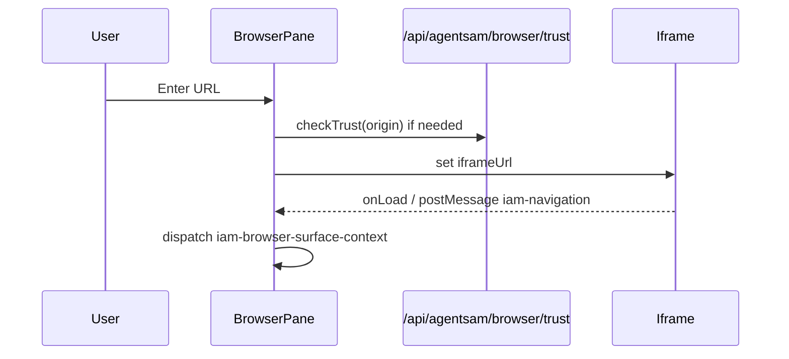
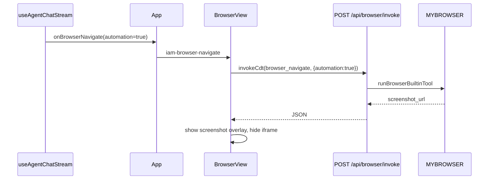

# Chunk 01 — Agent shell layout & BrowserView (iframe vs MYBROWSER)

**Audience:** Agent team (frontend repair, backend alignment, QA).  
**Rule:** Every behavior below is tied to **files in this repo**. If code diverges, trust the repo.

**Canonical UI package:** **`dashboard/`** only. There is no `agent-dashboard/` directory in this monorepo; do not use `docs/AGENT_DASHBOARD.md` build paths (`cd agent-dashboard`, `agent-dashboard.js`, etc.) for repair work here.

---

## 0. `dashboard/` — build, deploy, and URL

| Step | Command / artifact | Live reference |
|------|-------------------|----------------|
| Dev server | `cd dashboard && npm run dev` | `dashboard/package.json` scripts |
| Production bundle | `cd dashboard && npm run build` | Output: **`dashboard/dist/`** |
| Ship to R2 | `npm run deploy:frontend` (repo root) | `scripts/deploy-frontend.sh`: `DIST=dashboard/dist`, `PREFIX=static/dashboard/app` |
| Asset base URL | `/static/dashboard/app/` | `dashboard/vite.config.ts` `base` |
| Client route | `/dashboard/agent` | `dashboard/lib/agentRoutes.ts` — same SPA as `/dashboard/overview`, etc. |
| Legacy R2 URLs | `/static/dashboard/agent/*` still resolve | `src/core/dashboard-r2-assets.js` maps `agent/` → `app/` keys |

**Agent shell code-splitting:** `dashboard/App.tsx` comment ~line 86 — heavy dashboard pages are lazy-loaded; **agent shell + `/dashboard/agent` stay eager** (imports `BrowserView`, `ChatAssistant`, `WorkspaceDashboard` at top of `App.tsx`).

**Stale paths to ignore**

| Do not use | Use instead |
|------------|-------------|
| `agent-dashboard/` source tree | `dashboard/` |
| `agent-dashboard/agent-dashboard/dist/` | `dashboard/dist/` |
| `static/dashboard/agent/agent-dashboard.js` (legacy bundle name) | Vite chunks under `static/dashboard/app/` (e.g. `dashboard.js` per built `index.html`) |
| `dashboard/agent.html` + standalone `agent-dashboard.js` (if present locally) | Production shell: Worker serves SPA HTML from R2 `static/dashboard/app*`; routing is in `dashboard/App.tsx` |

---

## 1. Scope of this chunk

| In scope | Out of scope (later chunks) |
|----------|-----------------------------|
| What `/dashboard/agent` mounts in **`dashboard/App.tsx`** | R2 listing/open/save (`dashboard/components/LocalExplorer.tsx`, `/api/r2/*`) |
| Activity sidebar panels on the agent path | GitHub OAuth + repo tree (`GitHubExplorer`) |
| Main workbench tabs (Workspace, code, browser, …) | Full ChatAssistant SSE protocol |
| `BrowserView` passive iframe vs automation preview | PTY terminal session lifecycle |
| Worker `MYBROWSER` + `/api/browser/invoke` | Local git `SourcePanel` |

---

## 2. Route model

**File:** `dashboard/lib/agentRoutes.ts`

| Constant / helper | Value / behavior |
|-------------------|------------------|
| `AGENT_HOME_PATH` | `/dashboard/agent` |
| `AGENT_QUICKSTART_PATH` | `/dashboard/agent/quickstart` |
| `isAgentShellPath(pathname)` | `true` for agent home, quickstart, or any path under `/dashboard/agent/` |
| `isAgentHomePath(pathname)` | Exact match on `/dashboard/agent` only |

**Implication:** On agent shell paths, **`dashboard/App.tsx`** does **not** render lazy `<Routes>` for other dashboard pages in the main editor column—it renders the IDE workbench (tabs + `BrowserView` + optional quickstart overlay). All of this lives in the **`dashboard/`** Vite app, not a separate `agent-dashboard` package.

**Eager imports (not code-split):** `BrowserView`, `ChatAssistant`, `WorkspaceDashboard` — top of **`dashboard/App.tsx`** (~lines 9–41). Other dashboard routes use `React.lazy` in the same file (~line 86+).

---

## 3. Physical layout (agent home)

**File:** `dashboard/App.tsx` (agent branch ~2930–3320)

```
┌─────────────────────────────────────────────────────────────────┐
│ Top: UnifiedSearchBar, workspace switcher, browser/terminal    │
├────┬──────────────────────────────────────────┬─────────────────┤
│Act.│ Main workbench (tabs)                     │ ChatAssistant   │
│bar │  - Workspace (WorkspaceDashboard)         │ (SSE /api/     │
│    │  - code (MonacoEditorView)                │  agent/chat)    │
│    │  - browser (BrowserView)                  │                 │
│    │  - excalidraw / moviemode (lazy)          │                 │
│    │  - XTermShell when terminal open          │                 │
├────┴──────────────────────────────────────────┴─────────────────┤
│ Optional: activity sidebar (width sidebarW) when activeActivity set │
└─────────────────────────────────────────────────────────────────┘
```

### 3.1 Activity sidebar (`activeActivity`)

State type: `'files' | 'search' | 'mcps' | 'git' | 'debug' | 'actions' | 'drive' | 'database' | null`

**On `isAgentHomePath` only** (~2947–2979):

| `activeActivity` | Component | Role |
|------------------|-----------|------|
| `files` | `LocalExplorer` | Local folder (FS Access API), R2 section, embedded explorers |
| `search` | `KnowledgeSearchPanel` | RAG / chat history |
| `actions` | `GitHubExplorer` | Remote GitHub repos (OAuth) — rail often labeled “GitHub” on mobile |
| `git` | `SourcePanel` | **Local** git status via `/api/internal/git-status` — not GitHub API |
| `drive` | `GoogleDriveExplorer` | Drive files |
| `database` | `DatabaseBrowser` | D1/Supabase studio jump |
| `mcps` | `MCPPanel` | MCP tooling |
| `debug` | No sidebar — opens terminal problems tab | `toggleActivity('debug')` |

**Naming trap:** `activeActivity === 'actions'` hosts **`GitHubExplorer`**, not GitHub Actions CI. Do not confuse with `git` → `SourcePanel`.

`toggleActivity('files')` navigates to `AGENT_HOME_PATH` if you are on another dashboard route (~1772–1776).

### 3.2 Workbench tabs (`activeTab`)

Type: `'Workspace' | 'welcome' | 'code' | 'browser' | 'glb' | 'excalidraw' | 'moviemode'`

Default open tab: `'Workspace'` (~836–837).

| Tab | Visible when | Primary component |
|-----|--------------|-------------------|
| `Workspace` | `isAgentHomePath` && `activeTab === 'Workspace'` | `WorkspaceDashboard` (home: recents, plan tasks, open folder) |
| `code` | `activeTab === 'code'` | `MonacoEditorView` + `useEditor()` tabs |
| `browser` | `activeTab === 'browser'` | `BrowserView` with `url={browserUrl}`, `agentRunId={activeAgentRunId}` |
| `excalidraw` / `moviemode` | lazy `Suspense` | Draw / MovieMode studio |

`BrowserView` receives `isActive={activeTab === 'browser'}` so collab WebSocket and job polling only run when the browser tab is selected (~3261–3267).

### 3.3 Agent workspace context (chat payload)

**File:** `dashboard/src/ideWorkspace.ts`

`AgentWorkspaceContextPacket`:

- `activeTab`, `browserUrl`, `openFiles[]`, `plan_id`, `workflow_run_id`

Built in `App.tsx` `agentWorkspaceContext` useMemo (~861+) and passed to `ChatAssistant`, `MonacoEditorView`, `XTermShell`.

Persisted IDE bundle (per conversation): `GET/PUT /api/agent/workspace/:conversationId` — `ideWorkspace`, `gitBranch`, `recentFiles` (see same file).

---

## 4. BrowserView — two rendering modes

**File:** `dashboard/components/BrowserView.tsx`  
**Header contract (lines 7–11):** iframe by default; MYBROWSER only on explicit automation.

### 4.1 Passive mode (default)

**Mechanism:** Sandboxed `<iframe src={iframeUrl}>` (~1761–1785).

- Navigation: `navigateEmbedded` (~1353–1384) — sets `iframeUrl`, trust gate, no Worker browser.
- User URL bar Enter → `normalizeUrl` → `navigate(n)` without `automation` → embedded only.
- Agent/chat passive open: `surface_open` / `browser_navigate` with `automation !== true` → iframe.

**Same-origin extras:**

- `inspectSameOrigin` (~1068–1074) enables richer in-iframe picker via `postMessage` (`iam-element-selected`, `iam-navigation`).
- Cross-origin: iframe still loads; picker may fall back to MYBROWSER `cdt_evaluate_script` (~1085–1101).

**Context for chat (not automation):** `iam-browser-surface-context` CustomEvent on `currentUrl` change (~1047–1066) — URL, `route_path`, viewport.

### 4.2 Automation mode (MYBROWSER preview)

**Mechanism:** Hide iframe (`opacity-0`); show **screenshot overlay** from Worker (~1793–1816, `loadAutomationPreview` ~1307–1351).

Triggers:

1. `navigate(raw, { automation: true })` or `initialPreview.screenshot_url` on prop sync (~1412–1430).
2. Chat SSE: `browser_open_url` / `browser_navigate` / `cdt_navigate_page` with automation flag (~`useAgentChatStream.ts` 276–277, 1306–1318).
3. Toolbar: Take screenshot, area capture → `POST /api/browser/invoke` (~1433–1491).
4. DevTools panel: console/network/snapshot via `invokeCdt` (~584–660).

`invokeCdt` (~212–225):

```http
POST /api/browser/invoke
Content-Type: application/json
Cookie: session

{ "tool_name": "<registry or default>", "params": { "url": "...", "automation": true, "agent_run_id": "..." } }
```

Registry tool names loaded from:

```http
GET /api/agent/browser/registry-tools?workspace_id=<ws>
```

(~65–75 `fetchBrowserRegistryPickers`) — maps to D1 `agentsam_tools` / `agentsam_mcp_tools`, not hardcoded in UI.

### 4.3 Virtual URL schemes (no iframe navigation)

```ts
// BrowserView.tsx ~108–110
isVirtual(url) => /^(r2:|github:|local:|preview:)/i
```

`navigate` / `navigateEmbedded` **return early** if virtual (~1356, 1390). R2/GitHub files open in **Monaco** (chunk 02/03), not the browser URL bar.

### 4.4 Blocked / fallback UX

- `iframeBlocked` → `BlockedPage` + optional MYBROWSER screenshot (~1787–1790).
- `navigateError` on automation path → retry UI (~1804–1816).
- Trust: `checkTrust` / `writeTrust` → `/api/agentsam/browser/trust` (~180–199).

### 4.5 Split pane & collab

- Root `BrowserView` (~1955+): primary + optional secondary pane (`iam-browser-navigate-secondary`).
- WebSocket: `wss://<host>/api/collab/room/browser` when `isActive` (~2031–2137). Message types: `navigate`, `screenshot`, `agent_active`, `job_update`.
- HTTP probe on same path; 503/204 → `collabBridge = 'unavailable'`.
- Poll `GET /api/playwright` every 60s when tab active (~2007–2024) — job list health, not required for iframe browsing.

---

## 5. Chat / App → Browser wiring (contracts)

### 5.1 CustomEvents (window)

| Event | Emitter | Consumer | Payload (key fields) |
|-------|---------|----------|----------------------|
| `iam:agent-open-surface` | `useAgentChatStream`, `App` | `App` listener ~1555–1595 | `surface`: `browser` \| `code` \| `excalidraw` \| `r2` |
| `iam-browser-navigate` | `handleBrowserNavigateFromAgent` ~2197 | `BrowserView` ~1972 | `url`, `automation?`, `screenshot_url?` |
| `iam-browser-screenshot` | collab WS, agent tools | `BrowserPane` ~1280 | `screenshot_url` |
| `iam:browser-element-selected` | iframe picker | `ChatAssistant` | structured element for next message |
| `iam:agent-browser-tool-active` | SSE tool start | `App` ~1598 | `tool_name` → forces browser tab open |
| `iam-browser-surface-context` | BrowserView | ChatAssistant | URL, route, viewport |

**`surface: 'browser'`** (~1561–1568): sets `browserUrl`, `openTab('browser')` — **does not set `automation`** (iframe path).

**`surface: 'r2'`** (~1589–1590): dispatches `iam:palette-open-r2` → Files sidebar R2 section (chunk 02).

### 5.2 `handleBrowserNavigateFromAgent`

**File:** `dashboard/App.tsx` ~2176–2218

- Rejects URLs matching `/api/r2/file` (~2188–2190) — R2 belongs in editor, not BrowserView.
- Sets `browserUrl`, opens `browser` tab, dispatches `iam-browser-navigate` with `automation` + optional `screenshot_url`.

### 5.3 SSE automation flag

**File:** `dashboard/components/ChatAssistant/hooks/useAgentChatStream.ts`

- `pendingBrowserToolAutomation` set when tool input has `automation` / `use_automation` / `automate` OR tool name starts with `cdt_` (~62–64, 1107–1108).
- On `tool_done` for navigate tools: calls `onBrowserNavigate({ automation, ...preview })` (~1304–1318).
- Comment ~276: **`browser_open_url` + automation=true → MYBROWSER preview; passive → iframe only.**

---

## 6. Worker backend (MYBROWSER)

### 6.1 Binding

**File:** `wrangler.production.toml`

```toml
[browser]
binding = "MYBROWSER"
```

Health: `src/api/health/index.js` exposes `browser: !!env.MYBROWSER`.

Integrations page: `int_browser_rendering` checks `env.MYBROWSER` (`src/api/integrations.js`).

### 6.2 Dispatch

**Files:**

- `src/core/production-dispatch.js` — routes `/api/browser/*`
- `src/integrations/playwright.js` — `handleBrowserApiRequest`, `handlePlaywrightApiRequest`
- `src/integrations/browser-cdp.js` — `runBrowserBuiltinTool` (Playwright + Browser Rendering)
- `src/tools/builtin/web.js` — agent tool loop in-worker path (no MCP hop)

### 6.3 `POST /api/browser/invoke` (dashboard path)

**File:** `src/integrations/playwright.js` ~177–225

1. Session auth via `getAuthUser`.
2. `tool_name` + `params` from body.
3. Optional `assertBrowserTrustedOrigin` if `params.url` present.
4. `runBrowserBuiltinTool(env, toolName, params)`.
5. 503 if result hints `MYBROWSER` missing; 403 if `blocked`.

**Session reuse:** `browser-cdp.js` uses `browser-session.js` — acquire/connect per `agent_run_id` / workflow scope (~run-scoped KV).

**Screenshots:** `putAgentBrowserScreenshotToR2` in `browser-cdp.js` import from `src/core/r2.js` — preview URLs often R2 or dashboard proxy.

### 6.4 Related routes (same integration)

| Route | Method | Purpose |
|-------|--------|---------|
| `/api/browser/screenshot` | GET | Direct screenshot (launch browser) |
| `/api/browser/session/close` | POST | End run-scoped session |
| `/api/playwright` | GET | Job list (BrowserView polling) |
| `/api/playwright/screenshot` | POST | Job row + inline MYBROWSER handler |

---

## 7. Sequence diagrams (live behavior)

### 7.1 User opens URL in Browser tab (passive)



### 7.2 Agent opens URL with automation



---

## 8. Repair backlog (chunk 01 only)

Verify in repo before closing.

| ID | Symptom | Likely cause (live code) | Files to inspect |
|----|---------|--------------------------|------------------|
| B01 | Browser tab blank for external sites | iframe blocked; check `BlockedPage` / X-Frame-Options | `BrowserView.tsx` iframe + `BlockedPage` |
| B02 | Agent “opened browser” but no screenshot | `automation` false on tool input; iframe path only | `useAgentChatStream.ts` 1306–1318 |
| B03 | DevTools empty on cross-origin | console/network need MYBROWSER `invokeCdt` | `DevToolsPanel` ~632–660 |
| B04 | Picker toast “needs cdt_evaluate_script” | registry-tools returned null evaluate picker | `GET /api/agent/browser/registry-tools`, D1 tools |
| B05 | 503 on screenshot | `MYBROWSER` not bound in env | `wrangler.production.toml`, deploy target |
| B06 | Collab banner “unavailable” | `/api/collab/room/browser` 503/204 | `BrowserView.tsx` ~2068–2076 |
| B07 | `/api/r2/file` opened in browser | should be blocked in `handleBrowserNavigateFromAgent` | `App.tsx` ~2188 |
| B08 | Team confused GitHub vs git rail | `actions` = GitHubExplorer, `git` = SourcePanel | `App.tsx` ~2959 vs ~2972 |

---

## 9. Verification commands (no production deploy required)

From repo root (all paths under **`dashboard/`**):

```bash
# Confirm no agent-dashboard package in tree
test ! -d agent-dashboard && echo "OK: use dashboard/ only"

# Build output
ls dashboard/dist/index.html 2>/dev/null || (cd dashboard && npm run build)

# Route helpers
rg -n "isAgentShellPath|AGENT_HOME_PATH" dashboard/lib/agentRoutes.ts dashboard/App.tsx

# Browser dual-mode
rg -n "automation|invokeCdt|MYBROWSER|iframe" dashboard/components/BrowserView.tsx

# SSE → browser
rg -n "onBrowserNavigate|pendingBrowserToolAutomation|iam-browser-navigate" dashboard/components/ChatAssistant/hooks/useAgentChatStream.ts dashboard/App.tsx

# Worker invoke
rg -n "/api/browser/invoke|runBrowserBuiltinTool" src/integrations/playwright.js src/integrations/browser-cdp.js

# E2E smoke (needs BASE_URL + session)
# npx playwright test tests/e2e/dashboard-agent-workbench.spec.ts
```

---

## 10. Next chunk

**Chunk 02 — R2 explorer & `/api/r2/file`:** `LocalExplorer` R2 section, `openR2KeyInEditor`, save path, `r2_file_updated` SSE, `assertR2ObjectAccess` in `src/api/r2-api.js`.

---

*Chunk 01 — Agent workbench audit series. Update this file when behavior changes; do not fork parallel summaries without syncing the README index.*
