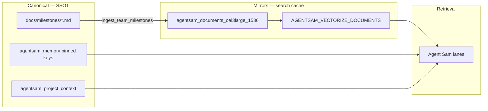

# Team milestone ingest pipeline (lightweight AutoRAG)

**Problem:** Full `reindex_codebase_dashboard_agent` (~288 files) is the wrong tool for “what did we ship yesterday on MovieMode?” Milestone truth sits in git markdown, D1 memory, and session chat — and often never reaches Vectorize.

**Solution:** Curated `docs/milestones/*.md` + manifest-driven ingest → **DOCUMENTS lane only** (~5–15 chunks per run).

---

## Architecture (3 layers)



| Layer | Role |
|-------|------|
| **Git milestones** | Human-edited ship receipts (MovieMode, client smokes, dashboard surfaces) |
| **IAM memory** | Short pinned operational state (`companionscpas_stripe_elements_*`, sprint keys) |
| **pgvector + Vectorize** | Semantic search mirror — rebuildable, not SSOT |
| **Code index** | Only when debugging handlers — scoped paths, not whole repo |

---

## What to index (and what to skip)

| Index this | Skip this |
|------------|-----------|
| `docs/milestones/*.md` (manifest) | Entire `src/` on every deploy |
| `docs/clients/*/project-brief.md` | `node_modules`, build artifacts, `.scratch/` |
| `docs/MOVIEMODE.md` when lane changes materially | Stale chat exports without curation |
| Pinned `agentsam_memory` (seed scripts) | Duplicate: same content in memory **and** 10 milestone files |

**Rule of thumb:** If the answer fits on one printed page, use a **milestone markdown** file. If the answer requires reading `src/api/foo.js`, use **scoped code ingest**.

---

## Weekly team workflow (~10 minutes)

### 1. Capture the milestone (author)

After a ship session:

1. Copy `docs/milestones/TEMPLATE.md` → `docs/milestones/YYYY-MM-DD-{topic}.md`
2. Fill frontmatter + H2 sections (Summary, Shipped, Open/next)
3. Add entry to `docs/milestones/manifest.json`
4. If client-facing: also update `docs/clients/{client}/project-brief.md`
5. If operational state: upsert `agentsam_memory` (or run seed pack)

### 2. Ingest (operator)

```bash
cd ~/inneranimalmedia

# Preview chunks + token estimates
npm run run:ingest_team_milestones:dry-run

# Live: Supabase pgvector + Vectorize + D1 receipt
npm run run:ingest_team_milestones
```

Requires `.env.cloudflare`: `OPENAI_API_KEY`, `SUPABASE_DB_URL`, `CLOUDFLARE_ACCOUNT_ID`, `CLOUDFLARE_API_TOKEN`.

### 3. Verify (30 seconds)

```bash
# D1 receipt
./scripts/with-cloudflare-env.sh npx wrangler d1 execute inneranimalmedia-business \
  --remote -c wrangler.production.toml --json \
  --command "SELECT chunk_key, status, updated_at FROM vectorize_sync_log WHERE chunk_key LIKE 'run:ingest_team_milestones%' ORDER BY updated_at DESC LIMIT 3"
```

Ask Agent Sam: *“What MovieMode progress shipped June 11 2026?”* — should hit `docs_knowledge_search` / milestone chunks.

### 4. Optional: R2 mirror for AutoRAG bucket

For `autorag_ingest.py --lane knowledge` compatibility, copy milestone to R2:

```bash
# Prefix: knowledge/milestones/YYYY-MM-DD-topic.md
npx wrangler r2 object put inneranimalmedia-autorag/knowledge/milestones/2026-06-11-moviemode-progress.md \
  --file=docs/milestones/2026-06-11-moviemode-progress.md --remote
```

Only needed if you also run Python `autorag_ingest.py --lane knowledge`. The Node script is sufficient for Agent Sam dashboard retrieval.

---

## Lane law

| Content type | Script | Vector binding | RAG lane at query time |
|--------------|--------|----------------|------------------------|
| Team milestone | `ingest_team_milestones.mjs` | `AGENTSAM_VECTORIZE_DOCUMENTS` | `docs_knowledge_search` |
| Client brief | `ingest_client_project_doc.mjs` | same | `client_project_semantic_search` |
| Code handlers | `reindex_codebase_dashboard_agent.mjs` (scoped) | `AGENTSAM_VECTORIZE_CODE` | `code_semantic_search` |
| Pinned ops state | `seed-*-memory-pack.mjs` | `AGENTSAM_VECTORIZE_MEMORY` (optional) | `memory_semantic_search` |

Never run **all lanes** in one job. One receipt per script per `run_id`.

---

## Current manifest (starter)

| File | Topic |
|------|-------|
| `docs/milestones/2026-06-11-moviemode-progress.md` | MovieMode templates, Stream live, webhooks |
| `docs/milestones/2026-06-12-companionscpas-donation-smoke.md` | Stripe smoke receipt |

---

## Anti-patterns (why Claude said embedding was inefficient)

1. **Reindexing whole repo** after a docs-only ship — wastes embed budget, dilutes search with irrelevant chunks
2. **Indexing chat transcripts** raw — noisy; distill to milestone md first
3. **Skipping manifest** — orphan md files never get ingested
4. **No `content_hash` skip** — always use protocol scripts (`rag-ingest-protocol.mjs`), not one-off curl upserts
5. **Memory + documents duplicate** — memory = short pinned state; milestones = narrative; brief = client SSOT

---

## Related

- `docs/milestones/README.md` — author checklist
- `scripts/lib/rag-ingest-protocol.mjs` — receipts, retry, hash skip
- `.cursor/rules/iam-rag-deploy-checklist.mdc` — deploy + ingest gates
- `skills/agentsam-vectorize-lanes/SKILL.md` — binding catalog
