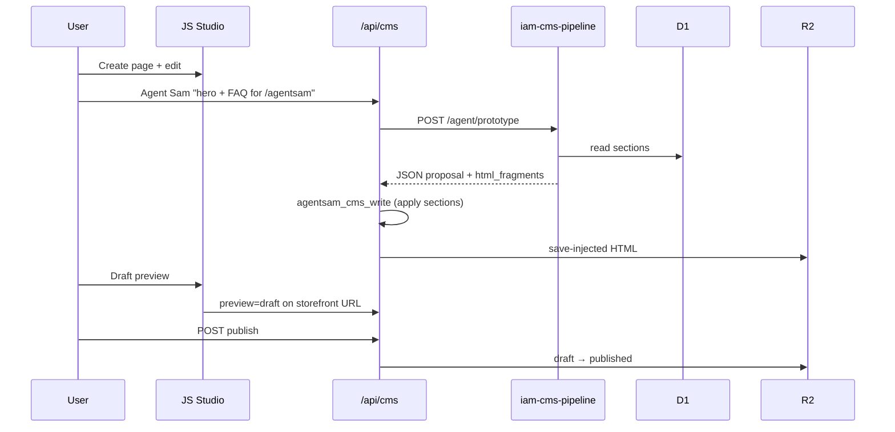

# Python CMS agentic pipeline — architecture & setup

Inner Animal Media runs a **dual-runtime CMS**: JavaScript Worker for auth, routing, studio UI, and publish gates; **Python Worker** for rapid HTML/agentic prototyping (BeautifulSoup, Workers AI, batch transforms).

This doc maps the Cloudflare Python Workers features you shared to our stack.

## Why two runtimes?

| Concern | JS Worker (`inneranimalmedia`) | Python Worker (`iam-cms-pipeline`) |
|---------|-------------------------------|-------------------------------------|
| Dashboard / studio iframe | ✅ | — |
| OAuth, sessions, `/api/cms/*` | ✅ | — |
| Storefront hydration + `?preview=draft` | ✅ | — |
| Publish promotion gates | ✅ | — |
| HTML parse / inject at scale | partial (`HTMLRewriter`) | ✅ BeautifulSoup |
| Agentic section proposals | via tool loop | ✅ Workers AI + structured JSON |
| Theme `.tar.gz` extract | queue handler | future: richer parsing |
| Local scripting / notebooks | — | ✅ same code in Worker |

Python Workers use **Pyodide (CPython WASM)** with **FFI to JS bindings** — your D1/R2/KV/AI bindings work from Python via `self.env.DB`, `self.env.ASSETS`, etc.

## Three lanes (unchanged)

1. **Studio** — `inneranimalmedia.com/studio/editor` (or dashboard iframe) — build/edit
2. **Draft preview** — `{domain}/{route}?preview=draft&cms=1` — real route, draft merge
3. **Live** — published HTML on project domain

Python pipeline **does not replace** the studio; it accelerates what agents and batch jobs do against the same D1/R2 truth.

## Cloudflare docs → our usage

### Foreign Function Interface (FFI)

- **Bindings**: `wrangler.jsonc` declares `DB`, `ASSETS`, `AI`, `SESSION_CACHE` — accessed in Python as `self.env.*`.
- **`to_js` / `from_js`**: Used in `agent_prototype.py` when passing dicts to Workers AI.
- **JS globals**: `from js import Response, fetch` — same Request/Response as JS Workers.

### Standard library

- Ephemeral filesystem OK for temp extract (theme tar unpack staging); **persist to R2/D1**.
- No `threading` / `multiprocessing` — use Queues or Workflows for parallel batch.
- Prefer **BeautifulSoup** (bundled via `pyproject.toml` + pywrangler) over unsupported C extensions.

### HTMLRewriter / SPA bootstrap

JS Worker already injects draft preview meta and CMS embed styles. Python service adds:

- `POST /pipeline/studio-bootstrap-html` — inject `window.__CMS_BOOTSTRAP__` (same pattern as Cloudflare SPA bootstrap doc).
- Use **HTMLRewriter in JS** for streaming production paths; Python for **offline/batch** transforms.

### pywrangler lifecycle

1. `uv sync` — lock deps
2. `uv run pywrangler dev` — Pyodide in local workerd
3. `uv run pywrangler deploy` — deploy-time import snapshot (fast cold starts)

## Install (first time)

```bash
# 1. uv (if missing)
curl -LsSf https://astral.sh/uv/install.sh | sh

# 2. Bootstrap service
cd /Users/samprimeaux/inneranimalmedia
./scripts/setup_cms_python_worker.sh

# 3. Local dev
cd services/cms-pipeline-service
uv run pywrangler dev --port 8788
curl -s http://127.0.0.1:8788/health
```

## Wire into main Worker (service binding)

Add to `wrangler.production.toml` after deploying Python worker:

```toml
[[services]]
binding = "CMS_PIPELINE"
service = "iam-cms-pipeline"
```

Dispatch from JS (e.g. Agent Sam tool or `/api/cms/pipeline/*` proxy):

```javascript
const res = await env.CMS_PIPELINE.fetch('https://cms-pipeline/agent/prototype', {
  method: 'POST',
  headers: { 'Content-Type': 'application/json' },
  body: JSON.stringify({ goal, page_id, project_slug: 'inneranimalmedia' }),
});
return res.json();
```

## End-to-end agentic flow (prototype → studio → publish)



## Python scripts in repo (local batch)

Existing `scripts/cms_*.py` run on your Mac against D1/R2 APIs. The Worker port lets the **same patterns** run at the edge next to bindings:

| Local script pattern | Worker endpoint |
|---------------------|-----------------|
| Manual HTML audit | `/pipeline/extract-sections` |
| Bootstrap audit | `/pipeline/bootstrap` |
| LLM section draft | `/agent/prototype` |

Recommended: add thin CLI wrappers that call deployed pipeline HTTP (session cookie or service token) instead of duplicating logic.

## Agent tools (suggested additions)

| Tool key | Calls | Approval |
|----------|-------|----------|
| `cms_pipeline_prototype` | `/agent/prototype` | medium |
| `cms_pipeline_extract` | `/pipeline/extract-sections` | low |
| `cms_pipeline_inject` | `/pipeline/inject` | high (writes go through `cms_write`) |

Keep **writes** on `agentsam_cms_write` + `save-injected` so audit trail and promotion gates stay centralized.

## Deploy checklist

- [ ] `uv run pywrangler deploy` from `services/cms-pipeline-service`
- [ ] DNS: `cms-pipeline.inneranimalmedia.com`
- [ ] KV id synced in `wrangler.jsonc`
- [ ] Service binding on `inneranimalmedia` (optional)
- [ ] Smoke: `/health`, `/pipeline/bootstrap?project_slug=inneranimalmedia`
- [ ] Agent Sam: test `cms_pipeline_prototype` with a real `page_id`

## Related docs

- [PRIMETECH_STUDIO.md](./PRIMETECH_STUDIO.md) — JS studio loop
- [cms/README.md](../../cms/README.md) — legacy `agentsam-cms-editor` Python repo
- [Cloudflare Python Workers](https://developers.cloudflare.com/workers/languages/python/)
