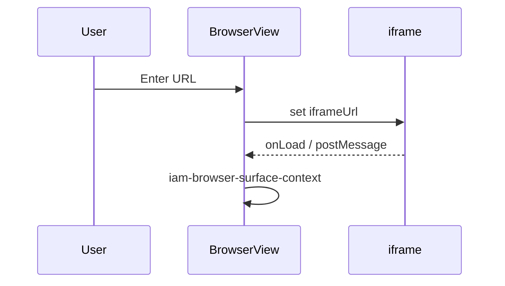
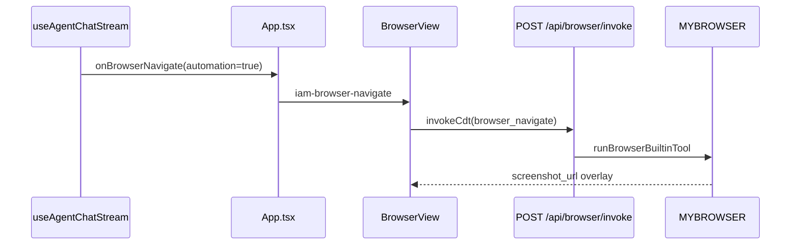

# Chunk 01 — Dashboard agent shell

**Status:** Live-code verified

## Purpose

Owns the **layout and surface switching** for live `/dashboard/agent`: activity rail, workbench tabs, chat panel mount, and how **BrowserView** vs **Monaco** vs **Workspace** share the center column.

## Live production scope

When a user opens **https://inneranimalmedia.com/dashboard/agent**, this chunk is the chrome they interact with before any specific tool (chat stream, R2 file, terminal) runs.

## Existing live code paths

| Kind | Path |
|------|------|
| Routes | `dashboard/lib/agentRoutes.ts` — `AGENT_HOME_PATH`, `isAgentShellPath`, `isAgentHomePath` |
| Shell | `dashboard/App.tsx` — agent branch ~2590–3320 |
| Browser UI | `dashboard/components/BrowserView.tsx` |
| Chat column | `dashboard/components/ChatAssistant/ChatAssistant.tsx` |
| Workspace home | `dashboard/components/WorkspaceDashboard.tsx` |
| Editor | `MonacoEditorView` (via `useEditor` in `dashboard/App.tsx`) |
| Files rail | `dashboard/components/LocalExplorer.tsx` |
| GitHub rail | `dashboard/components/GitHubExplorer.tsx` (`activeActivity === 'actions'`) |
| Local git rail | `dashboard/components/SourcePanel.tsx` (`activeActivity === 'git'`) |
| Worker browser | `src/integrations/browser-cdp.js`, `src/integrations/playwright.js` |
| Binding | `wrangler.production.toml` — `[browser] binding = "MYBROWSER"` |
| Trust | `/api/agentsam/browser/trust` (from `BrowserView.tsx`) |
| Registry tools | `GET /api/agent/browser/registry-tools` |

### Window events (live contracts)

| Event | Role |
|-------|------|
| `iam:agent-open-surface` | Open browser / code / excalidraw / R2 palette |
| `iam-browser-navigate` | Set BrowserView URL; optional `automation` |
| `iam-browser-surface-context` | URL/viewport → chat context |
| `iam:browser-element-selected` | Picker → chat |
| `iam:agent-browser-tool-active` | Force browser tab visible during tools |

## What is ALREADY engineered

### Route gating

- `isAgentShellPath` keeps agent on **eager** shell: `BrowserView`, `ChatAssistant`, `WorkspaceDashboard` imported at top of `App.tsx` (~line 86 comment: heavy routes lazy; agent stays mounted).
- Non-agent dashboard pages use lazy `<Routes>` in same file when `!isAgentShellPath`.

### Activity sidebar (`activeActivity`)

On agent home only (`isAgentHomePath`):

| Key | Component |
|-----|-----------|
| `files` | `LocalExplorer` |
| `search` | `KnowledgeSearchPanel` |
| `actions` | **`GitHubExplorer`** (not CI Actions) |
| `git` | **`SourcePanel`** (local `/api/internal/git-status`) |
| `drive` | `GoogleDriveExplorer` |
| `database` | `DatabaseBrowser` |
| `mcps` | `MCPPanel` |
| `debug` | Opens terminal problems; no sidebar |

### Workbench tabs (`activeTab`)

Default: `'Workspace'`. Tabs include `code`, `browser`, `excalidraw`, `moviemode`.

- **Browser tab:** `BrowserView` with `url={browserUrl}`, `isActive={activeTab === 'browser'}`, `agentRunId={activeAgentRunId}`.
- **Code tab:** `MonacoEditorView` + `agentWorkspaceContext`.
- **Workspace tab:** `WorkspaceDashboard` overlay on agent home.

### BrowserView: iframe default, MYBROWSER intentional

From `dashboard/components/BrowserView.tsx` header (~lines 7–11):

- **Default:** sandboxed `<iframe src={iframeUrl}>` — passive browsing, no Worker browser for every URL.
- **Automation:** `loadAutomationPreview` → `POST /api/browser/invoke` → screenshot overlay (iframe hidden).
- Chat sets automation via `useAgentChatStream.ts` when `automation: true` or `cdt_*` tool names (~276–277, 1306–1318).
- **Virtual URLs** `r2:`, `github:`, `local:`, `preview:` — `isVirtual()` skips iframe navigation; files open in Monaco (chunks 05–07).

### Surface routing from chat

`App.tsx` `handleBrowserNavigateFromAgent` (~2176): blocks `/api/r2/file` URLs in browser; opens browser tab + `iam-browser-navigate`.

`iam:agent-open-surface` listener (~1555): `surface: 'browser' | 'code' | 'excalidraw' | 'r2'` — browser opens **without** forcing automation.

### Preview routing

- HTML/SVG/MD from Monaco → blob URL in browser tab (`openEditorPreview` in `App.tsx` ~2425+).
- R2/GitHub opens via explorer → `openInEditorFromExplorer` → code tab (`revealMainWorkspaceIfNarrow` on mobile).

## What is PARTIALLY engineered

- **Collab bridge** `/api/collab/room/browser` — degrades to offline banner; non-blocking for iframe browse.
- **Cross-origin picker** — same-origin iframe postMessage works; cross-origin falls back to MYBROWSER `cdt_evaluate_script` (toast if registry missing).
- **Split browser panes** — primary/secondary via `iam-browser-navigate-secondary`.

## What is BROKEN

| Issue | Evidence |
|-------|----------|
| B01-001 | Users confuse automation screenshots with “broken iframe” | No in-UI mode indicator beyond automation overlay copy |
| GitHub vs git rail | `actions` vs `git` labels | Wrong panel opened for “source control” |
| Agent opens `/api/r2/file` in browser | Blocked in `handleBrowserNavigateFromAgent` — good; agent must use editor path consistently |

## UX reality today

**Desktop:** Dense IDE — rail + tabs + resizable chat. Usable for operators at desk.

**Mobile:** Chat can cover center (`narrowBlocksCenter` hides main column when chat or sidebar open). Opening Monaco without dismissing chat overlay was a known bug; `revealMainWorkspaceIfNarrow` + comment ~1483–1486 address it. Browser tab on phone is poor (chunk 03). **Not** a mobile operator console yet.

## Data / event / execution flow

### Passive URL in browser tab



### Agent automation navigate



## Validation commands

```bash
rg -n "isAgentShellPath|activeActivity|activeTab" dashboard/App.tsx | head -40
rg -n "iframe|loadAutomationPreview|invokeCdt|isVirtual" dashboard/components/BrowserView.tsx
rg -n "iam-browser-navigate|iam:agent-open-surface" dashboard/App.tsx dashboard/components/ChatAssistant/hooks/useAgentChatStream.ts
rg -n "runBrowserBuiltinTool|/api/browser/invoke" src/integrations/playwright.js src/integrations/browser-cdp.js
npx playwright test tests/e2e/dashboard-agent-workbench.spec.ts
```

## Acceptance criteria

- [ ] Can draw activity rail → component map from memory.
- [ ] Can explain iframe vs MYBROWSER in one sentence for operators.
- [ ] Can list three CustomEvents chat uses to open browser/code.
- [ ] Confirm production bundle is `dashboard/dist`, not `agent-dashboard`.

## Repair backlog IDs

| ID | Title | Paths | Expected | Validation |
|----|-------|-------|----------|------------|
| B01-001 | BrowserView iframe vs MYBROWSER clarity | `BrowserView.tsx` | Obvious UI mode: “Browsing” vs “Automation preview” | Manual + screenshot |
| B01-002 | Rename or label `actions` rail as GitHub | `App.tsx` activity labels | No confusion with `git` SourcePanel | UX review |

## Immediate next implementation step

Add a **persistent mode chip** in BrowserView toolbar: `Embedded` vs `Automation preview` tied to `screenshotUrl` / `automation` flag — smallest UX fix for B01-001.
