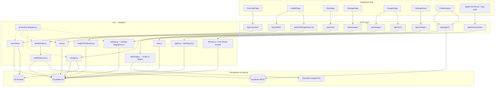

# Inner Animal Media — repo & dashboard sketch

Low-fidelity map: **where things live**, **how the dashboard build fits the Worker**, and **which `/dashboard/*` routes touch which files**. Not an exhaustive inventory.

---

## Build & deploy (one pass)

| Layer | Role |
|-------|------|
| **Cloudflare Worker** | `src/index.js` → `src/core/production-dispatch.js` routes HTTP to `src/api/*.js` handlers (D1, R2, auth, health, MCP, storage, settings, …). |
| **SPA (Vite)** | `dashboard/` → `npm --prefix dashboard run build` → static assets (often uploaded to R2; see root `package.json` scripts `build:vite-only`, `r2:deploy-manifest`, `upload-dashboard-app`). |
| **Config** | `wrangler.production.toml` — Worker bindings (D1, KV, R2, secrets). |
| **Schema** | `migrations/` (+ `migrations/d1/`) — D1 evolution. |

---

## Repo tree (abbreviated)

```txt
inneranimalmedia/
├── wrangler.production.toml    # Worker deploy / bindings
├── package.json                # root scripts (deploy, dashboard build, D1, R2)
├── server.js                   # optional local Node entry (marketing / dev)
│
├── src/                        # Worker — all /api/* and HTML shell routing
│   ├── index.js                # fetch entry
│   ├── core/
│   │   ├── production-dispatch.js   # central path router → api handlers
│   │   ├── auth.js, d1.js, r2.js, …
│   │   └── …
│   ├── api/
│   │   ├── health/             # /api/health/* (+ agentsam-d1 telemetry)
│   │   ├── overview.js         # /api/overview/* (KPIs, charts)
│   │   ├── mcp.js              # /api/mcp/* (agents, dispatch, tools)
│   │   ├── storage.js          # /api/storage/* (buckets, analytics, vectors)
│   │   ├── settings.js         # /api/settings/* (profile, workspaces, MCP tools)
│   │   ├── images (via index routes), themes, agent, …
│   │   └── …
│   ├── cron/                   # scheduled jobs (rollups, retention, …)
│   ├── do/                     # Durable Objects (chat, collab, …)
│   └── tools/                  # builtin tool dispatch (storage, deploy, …)
│
├── dashboard/                  # React SPA (Vite + Tailwind)
│   ├── index.tsx               # mount
│   ├── App.tsx                 # shell: sidebar, editor, terminal, <Routes>
│   ├── index.css               # @tailwind; imports inneranimalmedia.css, ops-overview-shell.css
│   ├── inneranimalmedia.css    # :root design tokens; CMS theme overrides
│   ├── pages/
│   │   └── HealthPage.tsx      # /dashboard/health
│   ├── components/
│   │   ├── OverviewPage.tsx    # /dashboard/overview
│   │   ├── McpPage.tsx         # /dashboard/mcp/:agentSlug?
│   │   ├── StoragePage.tsx     # /dashboard/storage
│   │   ├── ImagesPage.tsx      # /dashboard/images
│   │   ├── ChatAssistant.tsx   # in-shell agent chat (not route-only)
│   │   ├── health/             # HealthShell, D1TelemetryTab, …
│   │   └── settings/         # SettingsPanel + sections + hooks
│   │       ├── SettingsPanel.tsx
│   │       ├── settingsConstants.ts    # URL slugs ↔ labels
│   │       ├── hooks/useSettingsData.ts
│   │       └── sections/      # General, Tools & MCP, Integrations, CI/CD, …
│   ├── public/static/          # static assets for dashboard origin
│   └── dist/                   # build output (gitignored in many setups)
│
├── migrations/                 # D1 SQL (numbered + d1/)
├── supabase/                   # Auth hooks / Supabase-adjacent
├── cms/themes/                 # theme JSON for cms_themes pipeline
├── docs/                       # internal docs (this file: docs/dashboard/)
├── scripts/                    # deploy, ingest, inventory, playwright, …
├── tests/                      # e2e / quality
└── learn/                      # course content (separate from dashboard app)
```

---

## Dashboard routes → UI → APIs (main surfaces)

Routes are declared in **`dashboard/App.tsx`** (`react-router-dom`).

| Path | Component | Primary backend |
|------|-----------|-----------------|
| `/dashboard/overview` | `components/OverviewPage.tsx` | `/api/overview/*` |
| `/dashboard/health` | `pages/HealthPage.tsx` + `components/health/*` | `/api/health/*`, `/api/health/agentsam-d1` |
| `/dashboard/mcp` | `components/McpPage.tsx` | `/api/mcp/*` (agents, dispatch, tools, status) |
| `/dashboard/mcp/architect` | same | slug → `mcp_agent_architect` |
| `/dashboard/mcp/engineer` | same | slug → `mcp_agent_builder` |
| `/dashboard/mcp/analyst` | same | slug → `mcp_agent_inspector` |
| `/dashboard/mcp/devops` | same | slug → `mcp_agent_operator` |
| `/dashboard/storage` | `components/StoragePage.tsx` | `/api/storage/*` |
| `/dashboard/images` | `components/ImagesPage.tsx` | `/api/images`, `/api/cms/tenants` |
| `/dashboard/settings/:sectionSlug` | `components/settings/SettingsPanel.tsx` | `/api/settings/*`, integrations, themes, etc. |

**Settings slugs** (see `settingsConstants.ts`): `general`, `agents`, `ai-models`, `tools`, `rules`, `workspace`, `hooks`, `github`, `integrations`, `cicd`, `network`, `themes`, `storage`, `security`, `billing`, `notifications`, `docs`.

**Note:** `/dashboard/settings/storage` today is a small **`StorageSection`** placeholder; full storage UI is **`/dashboard/storage`**.

---

## Styling (dashboard)

1. **Tailwind v4** — `@import "tailwindcss"` in `dashboard/index.css`.
2. **Tokens** — `inneranimalmedia.css` defines `--solar-*`, `--bg-*`, `--text-*`, … on `:root`.
3. **CMS themes** — runtime: `dashboard/src/applyCmsTheme.ts` applies variables from `/api/themes/active` (workspace-scoped).

---

## Worker dispatch mental model

```
Request
  → src/index.js
  → production-dispatch.js
       → /api/health/*     → api/health/index.js (+ d1Telemetry.js, …)
       → /api/overview/*   → api/overview.js
       → /api/mcp/*        → api/mcp.js
       → /api/storage/*    → api/storage.js
       → /api/settings/*   → api/settings.js (+ settings-integrations.js, …)
       → static / HTML     → dashboard dist or asset pipeline
```

---

## Purpose of the dashboard buildout (whole system)

| Concern | What the shell does |
|--------|----------------------|
| **Workspace IDE** | `App.tsx`: Monaco, file tree, terminal, browser tab, GitHub/R2 panels — productivity surface around the same session. |
| **Ops visibility** | **Overview** + **Health**: costs, deploys, MCP reliability, D1 telemetry, advisor-style summaries. |
| **Agent control plane** | **MCP page** + **Settings → Agents / Tools**: four panel agents, tool allowlists, dispatch sessions. |
| **In-chat agent** | **ChatAssistant**: `POST /api/agent/chat`, sessions, commands — parallel to MCP board, DO-backed state. |
| **Storage & media** | **Storage** dashboard + **Images** + registry/policy APIs. |
| **Tenant config** | **Settings** slices: workspace, themes (`cms_themes` via `/api/themes/active`), integrations, CI/CD, hooks, GitHub. |

Everything above is **one Worker** serving **JSON APIs** + **static SPA**; **D1** is the default system of record for IAM/ops tables; **Supabase** backs some health/agent streaming reads.

---

## Wiring diagram: pages → API → Worker modules → data

Read **left → right** (or top → bottom in narrow viewers): UI **calls** HTTP; handlers **read/write** stores.



*Note:* **`ImagesPage.tsx`** calls **`GET /api/images`** and **`GET /api/cms/tenants`**. Tenants are served by **`handleCmsApi`** (`src/api/cms.js`). The **`/api/images`** implementation may live in an unlisted module, behind **`handleDashboardApi`**, or only in certain deploy branches — search the Worker for `pathLower` / `images` when wiring docs to code.

---

## Per-page lineage (compact)

```mermaid
flowchart TB
  subgraph ov["/dashboard/overview"]
    OV_UI[OverviewPage.tsx]
    OV_API["/api/overview/*"]
    OV_MOD[overview.js]
    OV_D1[(D1: usage, spend, deploys, CI, goals…)]
  end
  OV_UI --> OV_API --> OV_MOD --> OV_D1

  subgraph hl["/dashboard/health"]
    HL_UI[HealthPage + health/*]
    HL_SUM["/api/health/*"]
    HL_D1API["/api/health/agentsam-d1"]
    HL_MOD[health/index.js + queries.js]
    HL_D1T[d1Telemetry.js]
    HL_D1B[(D1 telemetry tables)]
    HL_SB[(Supabase agent streams)]
  end
  HL_UI --> HL_SUM --> HL_MOD --> HL_D1B
  HL_MOD --> HL_SB
  HL_UI --> HL_D1API --> HL_D1T --> HL_D1B

  subgraph mcp["/dashboard/mcp/*"]
    MCP_UI[McpPage.tsx]
    MCP_API["/api/mcp/*"]
    MCP_MOD[mcp.js]
    MCP_D1[(D1: agentsam_ai, mcp_agent_sessions, tools…)]
  end
  MCP_UI --> MCP_API --> MCP_MOD --> MCP_D1

  subgraph st["/dashboard/storage"]
    ST_UI[StoragePage.tsx]
    ST_API["/api/storage/*"]
    ST_MOD[storage.js]
    ST_D1[(D1: project_storage, r2_bucket_summary…)]
    ST_R2[(R2 ops)]
  end
  ST_UI --> ST_API --> ST_MOD --> ST_D1
  ST_MOD --> ST_R2

  subgraph im["/dashboard/images"]
    IM_UI[ImagesPage.tsx]
    IM_API["/api/images"]
    IM_CMS["/api/cms/tenants"]
    IM_CMS_MOD[cms.js]
    IM_CF[(Cloudflare Images)]
  end
  IM_UI --> IM_API
  IM_UI --> IM_CMS --> IM_CMS_MOD
  IM_API --> IM_CF

  subgraph set["/dashboard/settings/*"]
    SET_UI[SettingsPanel + sections]
    SET_API["/api/settings/* (+ themes, integrations)"]
    SET_MOD[settings.js + integrations.js + themes.js]
    SET_D1[(D1: auth_users, workspaces, policies…)]
  end
  SET_UI --> SET_API --> SET_MOD --> SET_D1

  subgraph shell["Shell · not route-only"]
    SH_UI[ChatAssistant in App.tsx]
    SH_API["/api/agent/* , /api/r2/* , …"]
    SH_MOD[agent.js + dashboard.js + r2-api…]
    SH_D1[(D1 + Supabase)]
  end
  SH_UI --> SH_API --> SH_MOD --> SH_D1
```



**Overview → representative D1 / joins** (from `overview.js`):  
`agentsam_usage_events`, `agentsam_command_run`, `spend_ledger`, `worker_analytics`, `agentsam_mcp_tool_execution`, `mcp_usage_log`, `deployments`, `cicd_pipeline_runs`, `cicd_github_runs`, `goals`, `launch_milestones`, `work_sessions`, `projects`, …

**Health → data paths**:
- `health/queries.js` — **Supabase**: `agentsam_stream_events`, `agentsam_routing_decisions`, `agentsam_tool_call_events`, `agentsam_error_events`; **D1**: deploy/MCP rows per helper.
- `health/d1Telemetry.js` — **D1**: `agentsam_execution_performance_metrics`, `agentsam_agent_run`, `agentsam_deployment_health`, `agentsam_health_daily`, `agentsam_mcp_tool_execution`, `agentsam_tool_call_log`, `agentsam_usage_events`, `agentsam_workflow_runs`, … (optional tables degrade gracefully).

**MCP board → D1** (`mcp.js`):  
`agentsam_ai`, `mcp_agent_sessions`, `agentsam_mcp_tools` / tool lists, `agentsam_mcp_tool_execution` (dispatch audits), …

**Storage → D1** (`storage.js`):  
`project_storage`, `r2_bucket_summary`, `worker_analytics_hourly`, `worker_analytics_errors`, `workspace_usage_metrics`, storage policies / vector indexes per endpoint.

**Settings → D1** (`settings.js`, integrations):  
`auth_users`, `user_settings`, `workspaces`, `agentsam_user_policy`, `tenant_activation_status`, `tenant_branding`, MCP/tool tables, …

**ChatAssistant → API** (`agent.js` family):  
`POST /api/agent/chat`, `/api/agent/sessions`, `/api/agent/commands`, tool execution — D1 + Supabase depending on path.

**Themes**:  
`ThemesSection` + `applyCmsTheme.ts` → **`/api/themes/active`** → **`cms_themes`** (D1) + CSS variables on `:root`.

---

## ASCII sketch (no Mermaid renderer)

```
┌─────────────────────────────────────────────────────────────────────────────┐
│  browser: dashboard/App.tsx + route components                               │
└───────────────┬─────────────────────────────────────────────────────────────┘
                │ fetch same-origin /api/*
                v
┌─────────────────────────────────────────────────────────────────────────────┐
│  src/index.js ──► src/core/production-dispatch.js                             │
└───────────────┬─────────────────────────────────────────────────────────────┘
                │
    ┌───────────┼───────────┬────────────┬──────────────┬──────────────────┐
    v           v           v            v              v                  v
overview.js  health/*     mcp.js      storage.js    settings*.js      agent.js …
    │           │           │            │              │                  │
    v           v           v            v              v                  v
   D1          D1 +        D1           D1             D1               D1 + Supabase
               Supabase                (+ R2 ops)      (+ OAuth cfg)
```

---

## D1 table clusters (reference only)

Not exhaustive — use **`migrations/`** as source of truth.

| Cluster | Examples |
|---------|----------|
| **IAM / tenant** | `auth_users`, `workspaces`, `user_settings`, `agentsam_user_policy`, `tenant_activation_status` |
| **Agent Sam / MCP** | `agentsam_ai`, `mcp_agent_sessions`, `agentsam_mcp_tools`, `agentsam_mcp_tool_execution`, `agentsam_command_run`, `agentsam_tool_chain` |
| **Telemetry / rollups** | `agentsam_usage_events`, `agentsam_execution_performance_metrics`, `workspace_usage_metrics`, `worker_analytics_*` |
| **Storage registry** | `project_storage`, `r2_bucket_summary`, storage policies / preferences tables touched by `storage.js` |
| **Deploy / CI** | `cicd_pipeline_runs`, `deployments`, `agentsam_deployment_health` |
| **CMS / themes** | `cms_themes` (+ related) |
| **Health D1 tab** | Many `agentsam_*` analytics tables; see `d1Telemetry.js` |

---

## Addendum: table identifiers by prefix (grep-derived)

**How this list was built**

1. **`migrations/**/*.sql` + `sql/**/*.sql`** — names after `CREATE TABLE` / `CREATE TABLE IF NOT EXISTS`.
2. **`src/**/*.js` + `sql`** — identifiers immediately following `FROM`, `JOIN`, `INTO`, `UPDATE`, or `TABLE` in SQL-shaped strings (misses dynamic SQL, string-built names, and some aliases; **under-counts** rarer paths).

**`__new` / `_new` suffixes** — migration-era swap tables; production may have been renamed to canonical names after `ALTER TABLE … RENAME`. Treat both as “schema evolution,” not necessarily all present in D1 at once.

### `ai_*` (9)

`ai_compiled_context_cache`, `ai_context_versions`, `ai_guardrails`, `ai_prompts_library`, `ai_provider_usage`, `ai_query_history`, `ai_query_snippets`, `ai_routing_rules`, `ai_search_analytics`

### `agent_*` (18)

`agent_command_audit_log`, `agent_command_proposals`, `agent_commands`, `agent_configs`, `agent_conversations`, `agent_costs`, `agent_db_query_history`, `agent_db_snippets`, `agent_execution_plans`, `agent_intent_patterns`, `agent_messages`, `agent_mode_configs`, `agent_notifications`, `agent_platform_context`, `agent_request_queue`, `agent_sessions`, `agent_telemetry`, `agent_workspace_state`

### `mcp_*` (11)

`mcp_agent_sessions`, `mcp_command_suggestions`, `mcp_entitlements`, `mcp_service_credentials`, `mcp_services`, `mcp_tool_calls`, `mcp_tool_usage`, `mcp_usage_log`, `mcp_workflow_runs`, `mcp_workflows`, `mcp_workspace_tokens`

### `workspace_*` (7)

`workspace_audit_log`, `workspace_connectivity_status`, `workspace_limits`, `workspace_members`, `workspace_members_new`, `workspace_settings`, `workspace_usage_metrics`

### `workspaces` (bare table name)

`workspaces`

### `agentsam_*` (78)

`agentsam_agent_run`, `agentsam_ai`, `agentsam_analytics`, `agentsam_analytics__new`, `agentsam_analytics_new`, `agentsam_approval_queue`, `agentsam_approval_queue_new`, `agentsam_artifacts`, `agentsam_bootstrap`, `agentsam_browser_trusted_origin`, `agentsam_cad_jobs`, `agentsam_code_index_job`, `agentsam_command_allowlist`, `agentsam_command_pattern`, `agentsam_command_run`, `agentsam_commands`, `agentsam_cron_runs`, `agentsam_deployment_health`, `agentsam_error_log`, `agentsam_escalation_new`, `agentsam_execution_context`, `agentsam_execution_context_new`, `agentsam_execution_dependency_graph`, `agentsam_execution_performance_metrics`, `agentsam_executions_new`, `agentsam_feature_flag`, `agentsam_fetch_domain_allowlist`, `agentsam_health_daily`, `agentsam_hook`, `agentsam_hook_execution`, `agentsam_hook_execution__new`, `agentsam_hook_execution_new`, `agentsam_hook_new`, `agentsam_ignore_pattern`, `agentsam_mcp_allowlist`, `agentsam_mcp_servers`, `agentsam_mcp_tool_execution`, `agentsam_mcp_tools`, `agentsam_mcp_workflows`, `agentsam_mcp_workflows_new`, `agentsam_memory`, `agentsam_memory_new`, `agentsam_model_drift_signals`, `agentsam_model_tier`, `agentsam_plan_tasks`, `agentsam_plan_tasks_new`, `agentsam_plans`, `agentsam_plans_new`, `agentsam_project_context`, `agentsam_project_context_new`, `agentsam_prompt`, `agentsam_prompt_versions`, `agentsam_routing_arms`, `agentsam_rules_document`, `agentsam_rules_revision`, `agentsam_scripts`, `agentsam_skill`, `agentsam_skill_invocation`, `agentsam_skill_revision`, `agentsam_slash_commands`, `agentsam_subagent_profile`, `agentsam_todo`, `agentsam_todo_new`, `agentsam_tool_call_log`, `agentsam_tool_chain`, `agentsam_tool_chain_new`, `agentsam_tool_stats_compacted`, `agentsam_tool_stats_compacted__new`, `agentsam_usage_events`, `agentsam_usage_rollups_daily`, `agentsam_user_feature_override`, `agentsam_user_policy`, `agentsam_webhook_events`, `agentsam_webhook_weekly`, `agentsam_webhook_weekly__new`, `agentsam_workflow_runs`, `agentsam_workspace`, `agentsam_workspace_state`

### `workflow_*` (2 in D1-oriented merge)

`workflow_checkpoints`, `workflow_runs`

---

### Supabase REST (`/rest/v1/...`) — same prefixes (Worker touches)

These **do not** appear only via the D1 SQL scrape above; they show up in **`src/**/*.js`** as Supabase paths. Merge mentally with D1 where both exist (e.g. workflow sync).

| Prefix bucket | Table / resource (PostgREST) |
|---------------|------------------------------|
| **agentsam_** | `agentsam_stream_events`, `agentsam_routing_decisions`, `agentsam_tool_call_events`, `agentsam_error_events`, `agentsam_model_cost_snapshots`, `agentsam_workflow_runs` |
| **mcp_** | `mcp_health_checks` |
| **agent_** | `agent_decisions` (see `src/core/retention.js`) |
| **workflow_** | `workflow_runs` (see `src/core/agentsam-supabase-sync.js` — path `WORKFLOW_RUNS_PATH`) |

Other `/rest/v1/` reads in health (`worker_events`, `worker_errors`, `worker_hourly_rollups`, `worker_daily_rollups`, `build_deploy_events`, …) are **out of scope** for the prefix groups you listed.

---

*Regenerate this addendum: merge `CREATE TABLE` names from `find migrations sql -name '*.sql'` with a `FROM|JOIN|INTO|UPDATE` scrape over `src`, then add Supabase paths via `rg '/rest/v1/' src`.*

---

*Generated as a navigation aid; regenerate or extend when major routes move.*
