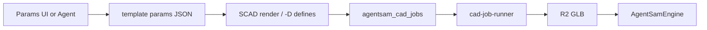

# Module 11 — IAM integration blueprint

**Time:** 45 min read · ongoing reference  
**Canonical inventory:** `docs/platform/design-cad-draw-inventory-2026-07.md`

## Target folder layout (repo)

```txt
scripts/designstudio/
  templates/
    openscad/
      gridfinity-bin/
      yapp-enclosure/
      l-bracket/
    freecad/
      bim-garage-massing/
    params/                    # JSON schemas per template
  fixtures/                    # smoke + E2E proofs
  cad-job-runner.mjs

src/core/
  openscad-library-resolver.js
  openscad-template-resolver.js   # (future)
  cad-dispatch.js
  iam-illustration-router.js

containers/iam-cad-worker/
  Dockerfile                   # openscad, blender, freecad, (+ cadquery future)
```

## Engine matrix

| Engine | Input | Runner | Primary output | Preview |
|--------|-------|--------|----------------|---------|
| openscad | `.scad` + libs | OpenSCAD | STL | GLB via Blender |
| freecad | `.py` macro | FreeCADCmd | STL/STEP/FCStd | GLB if STL |
| blender | `.py` | Blender | GLB | GLB |
| meshy | API prompt | Cloud | GLB/OBJ/… | GLB |
| cadquery | `.py` | cadquery CLI | STL/STEP | GLB |
| build123d | `.py` | build123d | STL/STEP | GLB |
| excalidraw | JSON scene | edge | PNG/JSON | Draw route |

## Agent entry (SSOT)

```javascript
// illustration_create envelope (simplified)
{
  "schema": "iam.illustration.v1",
  "intent": "Gridfinity bin 2x3, 6 units high",
  "engine": "auto",           // or openscad | freecad | ...
  "fidelity": "preview",
  "payload": { "template": "gridfinity-bin", "params": { ... } }
}
```

Router: `src/core/iam-illustration-router.js`

## Parametric template flow (Gridfinity pattern)



## R2 outputs convention

```txt
cad/exports/{tenant}/{workspace}/{job_id}.glb     # preview
cad/source/{tenant}/{workspace}/{job_id}.scad     # editable source
cad/source/.../model.step                         # manufacturing
cad/parts/{slug}/...                              # catalog (future)
```

## D1 tables (existing + proposed)

| Table | Role |
|-------|------|
| `agentsam_cad_jobs` | Queue + scripts + status |
| `agentsam_openscad_libraries` | Library imports |
| `designstudio_design_blueprints` | Intent lineage |
| `cms_assets` | Stock + user GLB/FCStd |
| `draw_libraries` | Excalidraw libs |
| *(future)* `agentsam_cad_templates` | slug, engine, params_schema, r2_scaffold_key |

## Priority build sequence

1. Vendor BOSL2 + one Gridfinity template on runner
2. Params panel → job regen in UI
3. FreeCAD macro STL export fix (STEP path parallel)
4. Parts catalog metadata (FreeCAD-library model)
5. CadQuery/build123d in container
6. BIM massing template
7. Assembly jobs

## Ship gate reminders

- Jobs require runner (`designstudio:runner` or ExecOS)
- `npm run designstudio:check` before CAD-touching commits
- Full deploy only when user opts in per iam-ship-gate
- No fake preview — GLB must come from runner output

## Lab: end-to-end proof

Follow `docs/inneranimalmedia/product/designstudio/E2E-TEST-PIPELINE.md`:

1. Blueprint or prompt → OpenSCAD job
2. Runner completes → R2 GLB
3. Design Studio loads model
4. iPhone Safari can view result (no local CAD install)

## Next module

→ `12-clone-setup-checklist.md`
