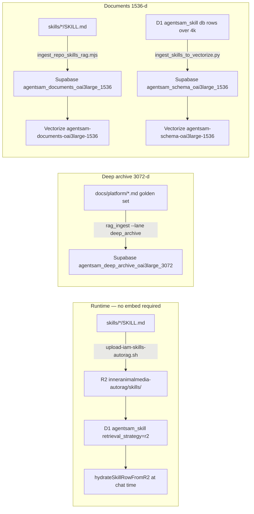

# IAM embedding pipeline — what goes where

Last verified: **2026-06-04**

Orchestrator: `./scripts/embed-golden-and-skills.sh`

---

## Three retrieval surfaces

| Surface | Purpose | When Agent Sam loads it |
|---------|---------|-------------------------|
| **R2 skills** | Full SKILL.md at runtime | Plan mode, slash triggers, `retrieval_strategy=r2` in D1 |
| **Deep archive (3072)** | Long architecture truth | `context.search` / deep RAG over golden platform docs |
| **Documents Vectorize (1536)** | Fast semantic search | `docs_knowledge_search`, knowledge panel, blended chat context |

Do not mix dimensions or indexes on the same lane. See `skills/agentsam-dual-vectorize-lanes/SKILL.md`.

---

## Step map



---

## Golden architecture docs (3072-d)

**Script:** `node scripts/rag_ingest.mjs --lane deep_archive`  
**Table:** `agentsam.agentsam_deep_archive_oai3large_3072`  
**Chunking:** one row per `##` H2 section  
**Embedding:** `text-embedding-3-large` at **full 3072 dims** (no `dimensions=` param)

Canonical sources (in `rag_ingest.mjs` `GOLDEN_SOURCES`):

| Key | Repo path |
|-----|-----------|
| `platform-wiring` | `docs/platform/iam-runtime-architecture-2026-06.md` |
| `platform-baseline` | `docs/platform/platform-baseline-2026-06-03.md` |
| `browserview-wiring` | `docs/platform/browserview-mybrowser-wiring-2026-06.md` |
| `tenant-credential-lanes` | `docs/platform/tenant-credential-lanes-2026-06.md` |
| `bindings-vectorize-api-map` | `docs/platform/bindings-vectorize-api-map-2026-06.md` |
| `autorag-runtime-contract` | `docs/autorag/AUTORAG_KNOWLEDGE_RETRIEVAL_RUNTIME_CONTRACT.md` |

Legacy helper (same H2 logic): `python3 scripts/embed_deep_archive_golden.py` — prefer `rag_ingest.mjs`.

---

## Repo skills (1536-d documents lane)

**Publish (R2 + docs-lane embed):** `./scripts/upload-iam-skills-autorag.sh`  
By default this uploads `skills/*/SKILL.md` to R2 **and** runs `ingest_repo_skills_rag.mjs` so semantic discovery stays current. Use `--skip-ingest` only when a parent pipeline (e.g. `embed-golden-and-skills.sh`) will embed in a later step. Selective: `--only deploy,iam-ship-main`.

**Embed only (search mirror refresh):** `./scripts/with-cloudflare-env.sh node scripts/ingest_repo_skills_rag.mjs`

| Artifact | Location |
|----------|----------|
| Source | `skills/{name}/SKILL.md` |
| R2 runtime key | `inneranimalmedia-autorag/skills/{name}/SKILL.md` |
| D1 registry | `agentsam_skill` with `metadata_json.r2_skill_key` |
| Search chunks | `agentsam_documents_oai3large_1536` (`source_type=knowledge`) |
| Vectorize | `AGENTSAM_VECTORIZE_DOCUMENTS` → `agentsam-documents-oai3large-1536` |

Law: writing an R2-backed skill without docs-lane ingest leaves exact-slash hydrate working and semantic discovery stale. The upload script is the durable trigger; do not treat R2 put alone as “skill shipped for RAG.”

---

## D1-only oversized skills (schema lane)

**Script:** `python3 scripts/ingest_skills_to_vectorize.py`  
**Threshold:** `LENGTH(content_markdown) > 4000` and `retrieval_strategy = 'db'`  
**Destination:** `agentsam_schema_oai3large_1536` + `agentsam-schema-oai3large-1536`

After ingest, D1 row moves to `retrieval_strategy=vectorize` with body on R2 under `knowledge/skills/{skill_id}.md`.

---

## One-shot commands

```bash
# Dry-run full pipeline
./scripts/embed-golden-and-skills.sh --dry-run

# Live full pipeline (R2 + deep archive + repo skills + D1 skills + Vectorize sync)
./scripts/embed-golden-and-skills.sh

# Only embed mcp-oauth + docx skills after editing SKILL.md
./scripts/with-cloudflare-env.sh node scripts/ingest_repo_skills_rag.mjs --only mcp-oauth-field-guide,docx

# Golden docs only (includes browserview wiring)
./scripts/with-cloudflare-env.sh node scripts/rag_ingest.mjs --lane deep_archive
```

**Env:** `OPENAI_API_KEY`, `SUPABASE_URL`, `SUPABASE_SERVICE_ROLE_KEY`, `CLOUDFLARE_ACCOUNT_ID`, `CLOUDFLARE_API_TOKEN`, optional `D1_WORKSPACE_KEY=ws_inneranimalmedia`.

---

## Related docs

- [Bindings Vectorize API map](./bindings-vectorize-api-map-2026-06.md)
- [BrowserView / MYBROWSER wiring](./browserview-mybrowser-wiring-2026-06.md)
- [AGENTSAM RAG lane schema reference](../supabase/AGENTSAM_RAG_LANE_SCHEMA_REFERENCE.md)
