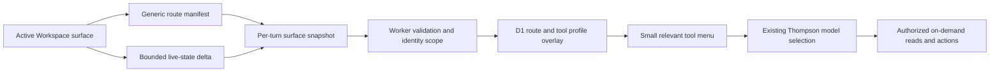

# AGENT-SURFACE-PROTOCOL — Agent-Native Workspace Surface Layer

## Product
Workspace | Agent Sam

## Ticket
- **D1 id:** `tkt_agent_surface_protocol`
- **dedup_key:** `agent-surface-protocol-2026-07`
- **Supersedes:** `tkt_152f6ada59b140e4` (broken `docs/surface-layer-plan.md`)
- **Source plan:** `~/.cursor/plans/agent-surface-protocol_3047a790.plan.md` (2026-07-17)
- **Status intent:** backlog / resume later — protocol + runtime overlay before per-surface publishers

## User outcome
Every Workspace/product surface shares one route-aware Agent Sam context protocol:

1. Active page publishes a **bounded** live-state snapshot (not a mega-context dump)
2. Worker validates, size-limits, and scopes identity/workspace server-side
3. D1 `agentsam_prompt_routes` + `agentsam_tool_profiles` overlay a small relevant tool menu
4. Thompson remains authoritative for model selection (no route-level model pinning)
5. Deeper data is on-demand through authorized tools only

## Architecture decision

One shared surface-context protocol — not unrelated per-page payloads and not permanent mega-context.

### Contract (locked)

- Typed `AgentSurfaceContextV1` + one client event `iam:agent-surface-context`
- Every route gets a generic manifest automatically; only stateful products publish a specialized delta
- Map keyed by surface ID; clear on route change; support replay so events before ChatAssistant mounts are not lost
- Snapshot fields: `surface_key`, `route_key`, `entity`, `selection`, `capabilities`, `state_summary`, `revision`, `observed_at`
- Replace ad-hoc `databaseContext` / `designStudioContext` / `mailContext` branches in `dashboard/components/ChatAssistant/ChatAssistant.tsx`
- Never trust user-supplied permission flags; derive identity, workspace, datasource access, write policy server-side
- Surface capability signals may inform runtime; routes must **not** pin models or bypass Thompson
- Apply the same structured context path to Ask, Plan, Agent, Debug, and Multitask
- Emit typed client-action SSE for UI mutations; retire fenced assistant JSON (e.g. Database Studio `iam_db_action`) as primary control channel

### Principal runtime defect (fix first)

`src/api/agent-chat-spine.js` parses route overrides but the ordinary session path builds `session@<mode>` and ignores them. Feed the trusted surface route into tool-profile resolution **or** key the session tool cache by `conversation_id + mode + route_key + profile_key`. Otherwise every new surface still receives the generic Agent menu.

## Tool-boundary correction (Database Studio reference)

- Do **not** expose inactive `database_assistant` as a universal Studio tool
- Use provider-native SQL tools:
  - D1 → `agentsam_d1_query` / `agentsam_d1_write`
  - Supabase/Postgres → `agentsam_supabase_query` / `agentsam_supabase_write`
- `env.DB` is a D1 binding, not a third engine; Hyperdrive is Postgres pooling, not a model-facing tool category
- Retire redundant inactive `hyperdrive_schema_inspect`
- Normalize inputs: D1 (`database`, `sql`, `params`); Supabase (`project`/`schema`, `sql`, `params`)
- Require server-resolved active resource for Studio calls — no silent platform DB fallback when resource omitted
- Keep reads/writes separate (policy + approval differ)
- CMS tools = domain operations with CMS invariants only; no aliases for raw D1/R2/KV on normal CMS profiles

### Database Studio context law

Context answers “what is open?” — not “here is the whole database.”

Publish: provider, authorized resource ref, dialect, active schema, selected table/cell, SQL buffer/selection, last error/result meta, capability flags. Do **not** dump catalogs or column inventories. Discover via real provider tools when asked.

### In-app Supabase lane repair (minimum)

1. `catalog-tool-executor.js` `hyperdrive`/`supabase`: forward `schema`, `params`, `table` into `dispatchCustomerDataPlaneOperation`
2. `customer-data-plane-dispatch.js`: pass `params` through to `runHyperdriveQuery`
3. Stop silent platform fallback for Database Studio turns
4. Normalize tool input schema docs
5. Wire Studio surface → tool menu (active provider pair only)
6. Prove parameterized Supabase + D1 reads, then one approved write each with refreshed Studio state

## Work phases (resume checklist)

| Phase | id | Outcome |
|-------|-----|---------|
| 1 | `surface-protocol` | `AgentSurfaceContext` schema, shared event, freshness/size limits, generic route manifest |
| 2 | `runtime-overlay` | Repair session profile/cache routing; Worker validation; D1 route→tool overlay; no mega-context; no route model pinning |
| 3 | `migrate-existing` | Migrate database, Design Studio, mail, browser, CMS, Movie Mode paths; Database = reference E2E |
| 4 | `create-surfaces` | Create-family bounded deltas + multimodal task routing |
| 5 | `collab-surfaces` | Collaborate, Mail, Meet, Learn adapters + consent/retention |
| 6 | `coverage-gate` | Remaining Workspace/operator routes; route manifest assertion; dual-pass E2E per surface |

## Surface coverage (summary)

See source Cursor plan for full per-route publish/capability lists. Families:

- **Workspace / Agent Sam** — home, agent, agent editor
- **Create** — Design Studio, Draw, Sketch (incubation), CMS, Images/DAM, Movie Mode
- **Collaborate** — Collaborate, Mail, Meet, Learn
- **Code / data** — Workflows, Database (reference impl)
- **Operator** — Projects, Artifacts/Tickets, Chats, Tasks, Overview/Analytics/Finance, Storage, Settings/Integrations/Docs

Registry law: every `/dashboard/*` route has a manifest **or** explicit `agent_disabled_reason`.

## Thompson preservation (locked)

- This ticket maps trusted route context + authorized tools. It does **not** redesign model selection.
- Keep Thompson/Beta loop, D1 arms, eligibility, fallback, outcome learning authoritative.
- Adapters may declare requirements (`vision_input_available`, `audio_stream_available`, `streaming_output`, `tools_required`, context size) as eligibility evidence — not model choices.
- Do not seed/promote/demote/pin arms merely because a route was added.

## Implementation sequence

1. Protocol + generic publisher + replay/freshness + Worker parser/validator + telemetry + D1 route→profile resolution
2. Repair chat spine so surface route/task/profile keys affect runtime compilation and cache identity; test route switching in one conversation
3. Migrate existing ad-hoc publishers; prove no context leakage across route changes
4. Ship Database first as reference (tool contracts, ownership binding, provider pair, read+approved-write E2E)
5. Create surfaces with multimodal references
6. Collaborate/Mail/Meet/Learn (consent-aware transcript retention)
7. Operator/support routes + registry assertion
8. Reconcile stale docs (Draw already `visual_canvas`; Movie Mode missing route context; Sketch unregistered)
9. Per surface: two E2E passes (context, limited tools, action/answer, route-switch isolation, no secret/cross-workspace leakage)

## Acceptance (ship gate)

- Dual-pass E2E (`required_pass_count = 2`) — deploy alone does not ship
- Database Studio reference path proven before broad surface rollout
- Session tool cache correctly keyed so route switches change the menu inside one conversation
- No route-level model pinning; Thompson unchanged except eligibility signals
- Route manifest coverage assertion green for `/dashboard/*`

## Out of scope

- Redesigning Thompson / Beta model selection
- Per-user Wrangler secrets
- Hardcoding `au_*` / `ws_*` / `tenant_*` in hot paths
- Mega-context injection of table catalogs or full conversation bodies
