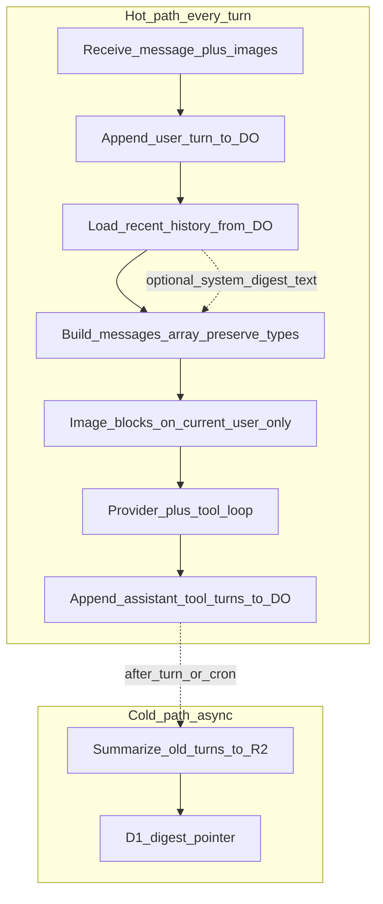

# Agent Sam spine E2E — Cursor parity (vision + thread + tools)

**D1 ticket:** `tkt_agentsam_spine_e2e_20260716`  
**Status:** `active` · **Priority:** P0 · **Project:** `inneranimalmedia` · **Subsystem:** `agent_spine`  
**Law:** dual-pass E2E before `shipped` (`required_pass_count = 2`). Deploy ≠ pass.

## Product outcome (pass/fail for the company)

In-app Agent Sam on `inneranimalmedia.com/dashboard/agent` must be able to replace Cursor for operator daily work on this stack. If it cannot, the project is canceled.

**Must be true end-to-end (user-proven, not agent-claimed):**

1. **Vision** — drop/paste an image in the composer; the model *sees* it. Not Scratchpad theater. Not backlogable.
2. **Thread memory** — turn N can reference turn N−1 without “first exchange.”
3. **Tools execute** — real tool_call / results; not chatbot with a 100-tool menu.
4. **Infra reach** — D1, CF catalog tools, GitHub, local FS (FSA) when connected.
5. **Auto stays Auto** — D1 catalog/arms; vision turns → vision-capable rows only.

---

## Architecture redirect (this is the conversation)

**Legitimate criticism:** diagnose → patch → adjacent bug = whack-a-mole on a bad foundation.

**Do not:** patch `normalizeMessagesForCompaction` and keep calling it on every turn before the provider API.  
**Do:** rip the hot path down to the simple model; rebuild history management as a **non-destructive cold layer**.

### The simple model that works (claude.ai / Cursor)

```text
1. User sends message + optional image
2. Server appends that turn to conversation history (DO)
3. Full recent history → model as messages[]
   - content arrays intact (text + image)
   - no normalize / stringify / utility soup on the hot path
4. Model responds (+ tools)
5. Response appended to history
6. Repeat
```

Trimming / summarizing old turns = **separate background concern**. Never type-mutates the live array about to be sent.

### What Agent Sam does today (wrong place)

Runs a compaction utility on **every** Agent turn that always `normalize`s messages (stringifies non-string `content`) **directly before** the model call — a consistency helper sitting where only “build messages[]” should sit.

### Target shape



| Layer | Responsibility |
|-------|----------------|
| **Hot** | append → load last N → attach vision on current turn → API → append |
| **Cold** | when over budget, summarize **old** turns → R2; D1 pointer; hot path may **read** digest as system text only |

### Rip list

1. Delete hot-path call to `compactConversationMessagesIfNeeded` in `agent-controller.js`.
2. Add thin `buildProviderMessages({ history, currentUserTurn, optionalDigestText })` — slice + append + types pass-through.
3. Vision only mutates **current** user message `content[]`.
4. Real summarize → `waitUntil` / cron / post-turn cold path only.
5. `normalizeMessagesForCompaction` either dies or is cold-path-only and **never** stringifies image arrays.

---

## Why previous attempts failed (2026-07-16)

| Attempt | Result | Root cause |
|---------|--------|------------|
| Dump ~103 tools into DO session | List worked; still amnesiac/blind | Tools ≠ thread ≠ vision ≠ dispatch |
| Session tool cache | cache_hit 102 | Never hydrated chat into model messages |
| Image in UI | “No image arrived” | Hot-path normalize stringifies `content[]` |
| Auto | Qwen mush / lottery | Workers AI reasoning as tokens; no vision gate |
| Patch-stringify | Would not fix foundation | Utility still on hot path |

**Anti-patterns:** tool-count theater; celebrity model hardcode; another DO “bootstrap” that isn’t the Messages payload; claim fixed after deploy without dual E2E.

---

## Workstreams

### WS0 — Instrumentation
Log: `history_hydrate`, `vision { blocks, content_is_array }`, `model`, `tools_invoked`, `hot_path.compaction_called=false`.

### WS1 — Rip hot path + vision (P0)
Implement simple model above. Vision + turn-2 memory in same slice. Auto vision catalog gate. Workers AI think leak gated.

**You prove:** image describe works; turn 2 remembers turn 1; compaction not on hot path.

### WS2 — Cold history
Async digest when over budget; hot path reads digest text only; DO prune policy decided explicitly later.

### WS3 — Execute tools (not dump)
Bounded/relevant tools or proven long-context invoke; ledger proof; hang → done/error.

### WS4 — Infra goldens
D1 / R2 / GitHub / FSA with proof IDs.

### WS5 — Dual-pass → ship
`record:ticket-e2e-pass` ×2 → `assert:ticket-shippable --set-shipped`.

---

## Key files

- Hot path: `src/core/mode-controllers/agent-controller.js`, new `buildProviderMessages` helper
- History: `src/core/agentsam-chat-sessions.js` (`getChatMessages`, `appendChatMessage`)
- Vision: `src/core/chat-composer-attachments.js`, `dashboard/.../ChatAssistant.tsx`
- Cold (later): `src/core/conversation-compaction.js` (off hot path)
- Tools/FSA: `src/core/agent-tool-loop.js`, `src/api/agent.js` fs/fulfill
- Auto: `resolveModel` + `agentsam_model_catalog`

## Definition of done

Attach screenshot → agent sees it → conversation has memory → D1/GitHub/FSA work — without Cursor. Two E2E passes. Ticket shipped only via assert.
