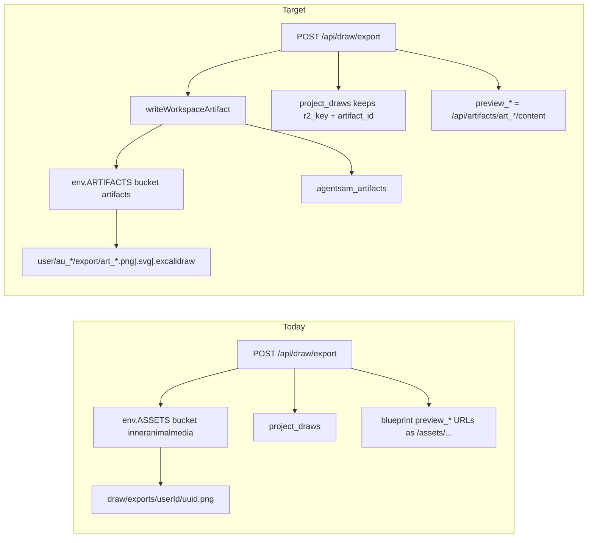

# DRAW-EXPORT-ARTIFACTS — Route Draw plan exports to ARTIFACTS

## Product
Create | Draw | Artifacts

## Ticket
- **D1 id:** `tkt_draw_export_artifacts`
- **dedup_key:** `draw-export-artifacts-2026-07`
- **Source plan:** `~/.cursor/plans/draw_export_artifacts_fcd9290d.plan.md` (2026-07-17)
- **Status intent:** in_review — export writes `env.ARTIFACTS` + `agentsam_artifacts`; dual-pass E2E before shipped

## User outcome
`POST /api/draw/export` (PNG / SVG / scene) lands on `env.ARTIFACTS` (`artifacts` bucket) with canonical `user/{au_*}/export/…` keys and `agentsam_artifacts` rows, so previews use `/api/artifacts/{id}/content` instead of public `/assets/…` ASSETS passthrough.

## Current vs target

**Today (verified 2026-07-19):** PNG/SVG/scene go to ASSETS under `draw/exports/…` and `draw/scenes/…`; public URLs are `/assets/{key}`. No `agentsam_artifacts` rows from this path.

**Target:** same export API shape, writes via artifact store into `ARTIFACTS`, D1 registry rows, auth-gated content URLs.

## Scope (locked)

| In | Out |
|----|-----|
| `POST /api/draw/export` only (PNG + SVG + optional scene) in `src/api/draw.js` | Older `POST /api/draw/save` |
| Binary-safe `writeWorkspaceArtifact` + `svg` format in artifact-key | Download-by-`project_draws` ASSETS reads |
| Blueprint `preview_*` → `/api/artifacts/{id}/content` | Dual-write to ASSETS |
| | Migrating historical `draw/exports/*` on ASSETS |
| | CAD GLB paths (`cad/exports/…`) |
| | BYOK tenant R2 for Draw |

## Work phases

| Phase | id | Outcome |
|-------|-----|---------|
| 1 | `binary-write` | Extend `writeWorkspaceArtifact` + `artifact-key` for SVG / binary PNG (`contentBytes`, content-type override, correct `file_size_bytes`) |
| 2 | `draw-export` | Point `POST /api/draw/export` at ARTIFACTS + `agentsam_artifacts`; update `project_draws.exports_json` + blueprint preview URLs |
| 3 | `ship` | `node --check`, manual export proof, commit/push/deploy per ship lanes |

## Implementation notes

### 1. Binary-safe artifact writes (`src/core/artifact-r2-store.js`)

- Accept `contentBytes` (`Uint8Array` / `ArrayBuffer`) **or** string `content`
- Allow `contentType` override (`image/png`, `image/svg+xml`)
- `file_size_bytes` from byte length (not `TextEncoder` on binary)
- Keep existing string path for markdown/json/excalidraw

### 2. Formats / keys (`src/core/artifact-key.js`)

- Format `svg` → ext `svg` (+ content-type map)
- PNG: existing `image` → `png`
- Scene: existing `excalidraw`
- Kind: `export` (already in `ARTIFACT_KINDS`)
- Keys: `user/{userId}/export/{art_id}.{ext}` via `buildArtifactR2Key` (no `workspace_id` in path)

### 3. Wire export API (`src/api/draw.js`)

- Resolve `workspaceId` / `tenantId` from auth/request context — never hardcode `ws_*`
- Require `env.ARTIFACTS` (fail clearly if missing)
- Per payload:
  - PNG → `writeWorkspaceArtifact({ artifactType: 'image', kind: 'export', contentBytes, contentType: 'image/png', source: 'draw_export', … })`
  - SVG → `artifactType: 'svg'`, `image/svg+xml`
  - Scene → `artifactType: 'excalidraw'`, JSON string
- Response (familiar shape, artifact lane):
  - `public_url` / `svg_public_url` → `/api/artifacts/{id}/content`
  - `artifact_id`, `svg_artifact_id`, `scene_artifact_id`
  - `r2_key` / `svg_r2_key` = ARTIFACTS keys
- Still update `project_draws.exports_json` with artifact ids + keys
- Blueprint attach: `preview_image_url` / `preview_svg_url` → artifact content URLs

### 4. Client / chat compatibility

- `dashboard/lib/drawPlanExport.ts` already consumes `public_url` / `svg_public_url` — no change if API shape holds
- Chat `preview_artifact` already accepts same-origin `/api/artifacts/…/content`
- Blueprint thumbs hit authenticated artifact content route

## Acceptance

- New export: `agentsam_artifacts.r2_bucket = 'artifacts'`, key prefix `user/au_…/export/`
- `GET /api/artifacts/{id}/content` returns PNG/SVG for signed-in owner
- Blueprint preview URLs point at artifact content routes
- Historical ASSETS `draw/exports/*` left untouched
- Dual-pass E2E before `shipped` (`required_pass_count = 2`)
